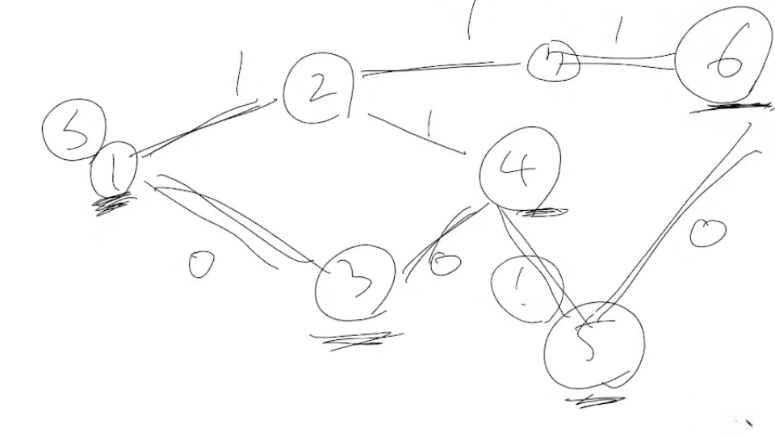

# 0 1 BFS

- 간선의 가중치가 0과 1로 이루어진 그래프에서 최단 경로를 찾는 알고리즘
- 양방향 요소 삽입이 가능한 Deque를 이용해 구현
- 일단 deque에서 맨 앞 요소를 pop
- 다음 노드로 가는 간선의 가중치가 0이면 deque의 앞에 요소를 추가하고, 가중치가 1이면 deque의 뒤에 요소를 추가
  - queue는 최대 2개의 레벨에서 항상 정렬된 상태를 유지
- 일반적인 BFS처럼 간선의 개수(E)만큼 탐색 하고, 정점의 개수(V) 만큼 중복없이 방문하므로 시간복잡도는 O(V + E)
  - 시간복잡도 계산 및 증명 : https://justicehui.github.io/medium-algorithm/2018/08/30/01BFS/

```python
# example.py

from collections import deque

def 0_1_bfs(graph, s):
    dist = [float('inf')] * n
    dist[s[0]] = 0
    q = deque([s])
    while q:
        here, weight = q.popleft()
        
        for next, next_weight in graph[here]:
            if dist[next] > here + next_weight:
                dist[next] = here + next_weight
                if next_weight:
                    q.append((next, next_weight))
                else:
                    q.appendleft((next, next_weight))
    
    print(dist[1:])
    
    
graph = [0, [(2, 1), (3, 0)], [(1, 1), (4, 1), (7, 1)],
        [(1, 0), (4, 0)], [(3, 0), (2, 1), (5, 1)], 
         [(4, 1), (6, 0)], [(5, 0), (7, 1)], [(2, 1), (6, 1)]
        ]

0_1_bfs(graph, 1)
```



- 참고) 류호석님의 유튜브 


## 연습문제) 백준 13549 숨바꼭질3

```python
# s1.py

# 0 1 bfs를 이용한 풀이
# 가중치가 0과 1인 너비 우선 탐색, 시간 복잡도 O(V + E)

from collections import deque

N, K = map(int, input().split())
q = deque([(0, N)])                                     # (소요된 시간, 현재 위치)
dist = [float('inf')] * (100001 * 2)
dist[N] = 0
while q:
    t, here = q.popleft()

    if here == K:
        print(t)
        break

    # 현재 위치와 인접한 노드( here - 1, here + 1, 2 * here )
    # 간선 가중치가 0이면 front append, 1이면 back append
    for cost, next in [(1, here - 1), (1, here + 1), (0, 2 * here)]:
        if next >= len(dist) or next < 0:
            continue
        
        if dist[next] > t + cost:
            dist[next] = t + cost
            if cost:
                q.append((t + cost, next))
            else:
                q.appendleft((t + cost, next))


```

