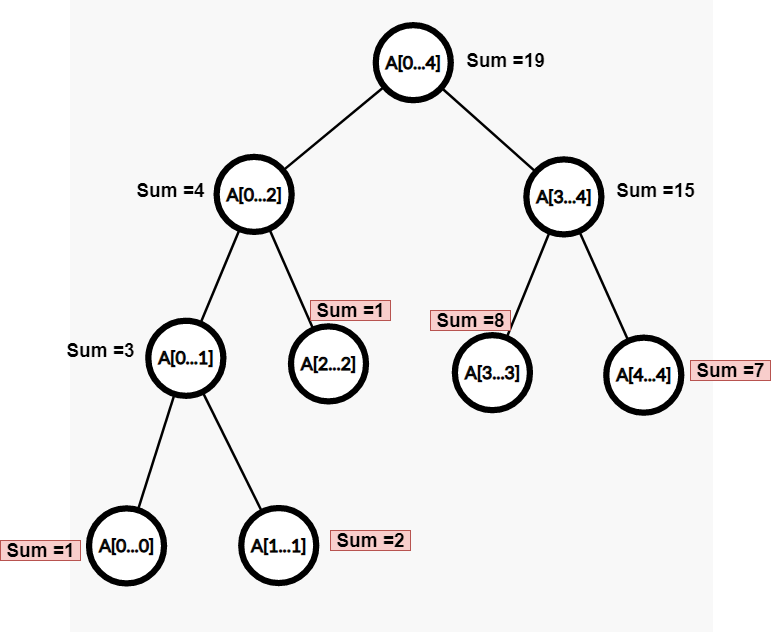

# 세그먼트 트리

- 구간합을 구할 때 사용할 수 있는 자료구조
- 구간에 대한 정보를 각각의 노드에 저장



## 세그먼트 트리 초기화(build)

- 세그먼트 트리의 최대 길이는 주어진 배열 N \* 4 + 1

  - 이유
    - 다음 레벨을 탐색할 때마다 log n씩 나누어지고, 노드의 총 개수는 다음 레벨에서 2배씩 늘어난다.
    - 1 + 2 + 4 + 8 ... + 2^(logn) = 2 ^ (logn + 1) - 1
    - 2 ^ (logn + 1)은 4n보다 무조건 작기 때문에 최대 노드의 개수로 4n까지 정할 수 있는 것

- 초기화 로직
  - 주어진 범위를 반으로 나눈다.
  - leaf 노드라면 해당 배열의 요소를 트리에 저장한다.
  - leaf 노드가 아닌 노드라면, 구간의 정보를 저장한다.(구간 합이라면 두 개의 자식 노드 합을 저장)

```python

N = 5
arr = [1,2,3,4,5]

# segment tree
tree = [0] * (N * 4 + 1)                # 세그먼트 트리의 길이는 배열 길이 N * 4을 최대로 설정(1부터 시작하기 위해 +1)

def init(start, end, index):
    mid = (start + end) // 2
    if start > end:
        return 0
    if start == end:
        tree[index] = arr[start]
        return tree[index]

    left = index * 2
    right = index * 2 + 1

    tree[index] = init(start, mid, left) + init(mid + 1, end, right)
    return tree[index]

init(1, N, 1)
```

## 세그먼트 트리 구간 정보 접근(query)

- 트리를 순회
  - 해당 노드가 구하고자 하는 범위 밖에 있는 노드라면 0을 반환
  - 해당 노드가 구하고자 하는 범위 내부에 있다면 값을 반환
  - 노드가 저장하고 있는 구간 정보가 구하고자 하는 범위의 일부만 포함한다면, 왼쪽과 오른쪽 자식을 나누어 탐색하여 둘의 합을 반환

```python
def query(start, end, index, left, right):
    '''
    start: 트리의 현재 노드에서의 시작 구간
    end: 트리의 현재 노드에서의 끝 구간
    index: 트리의 현재 노드
    left: 구하고자 하는 구간의 시작
    right: 구하고자 하는 구간의 끝
    '''

    # 구하고자 하는 구간이 현재 트리의 구간을 벗어나는 경우를 제외
    if left > end or right < start:
        return 0

    # 노드의 구간이 구하고자 하는 범위에 속하는 경우에 대해 현재 노드의 값을 반환
    if left <= start and right >= end:
        return tree[index]

    mid = (start + end) // 2
    return get_sum(start, mid, index * 2, left, right) + get_sum(mid + 1, end, index * 2 + 1, left, right)

```

## 세그먼트 트리 구간 정보 갱신(update)

- 배열에서 값을 수정한 index를 target으로 둔다.
- 값을 수정하기 전과 수정 후의 차이를 구한다.(diff)
  - tree를 순회하면서 구간의 정보를 diff만큼 갱신
  - target이 현재 노드의 구간 범위 이내라면 현재 노드에 저장된 정보에 diff만큼 차이를 뺀다.
  - 범위 밖이라면 그대로 순회를 종료한다.
  - 계속 자식 노드를 순회하면서 target을 범위 이내로 두고 있는 노드의 구간 정보를 갱신한다.

```python
# 배열의 특정 인덱스의 값을 수정할 때 구간합 갱신 로직
def update(start, end, index, target, diff):
    '''
    start: 트리의 현재 노드에서의 시작 구간
    end: 트리의 현재 노드에서의 끝 구간
    index: 트리의 현재 노드
    target: 배열에서 수정하려는 값의 인덱스
    diff: 배열에서 수정하기 전의 값과 수정 후의 값의 차이
    '''

    if target < start or target > end:
        return

    tree[index] -= diff                     # 구간합 갱신

    if start == end:
        return

    mid = (start + end) // 2
    update(start, mid, index * 2, target, diff)
    update(mid + 1, end, index * 2 + 1, target, diff)
    return
```
