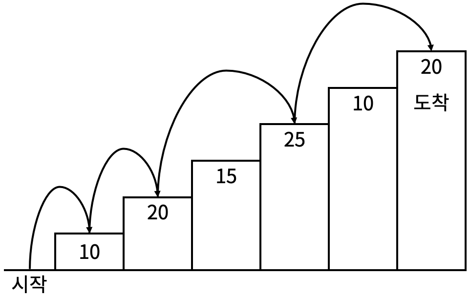

# 문제 설명

계단 오르기 게임은 계단 아래 시작점부터 계단 꼭대기에 위치한 도착점까지 가는 게임이다. <그림 1>과 같이 각각의 계단에는 일정한 점수가 쓰여 있는데 계단을 밟으면 그 계단에 쓰여 있는 점수를 얻게 된다.

---


<그림 1>

예를 들어 <그림 2>와 같이 시작점에서부터 첫 번째, 두 번째, 네 번째, 여섯 번째 계단을 밟아 도착점에 도달하면 총 점수는 10 + 20 + 25 + 20 = 75점이 된다.


<그림2>

계단 오르는 데는 다음과 같은 규칙이 있다.

1. 계단은 한 번에 한 계단씩 또는 두 계단씩 오를 수 있다. 즉, 한 계단을 밟으면서 이어서 다음 계단이나, 다음 다음 계단으로 오를 수 있다.

2. 연속된 세 개의 계단을 모두 밟아서는 안 된다. 단, 시작점은 계단에 포함되지 않는다.

3. 마지막 도착 계단은 반드시 밟아야 한다.

따라서 첫 번째 계단을 밟고 이어 두 번째 계단이나, 세 번째 계단으로 오를 수 있다. 하지만, 첫 번째 계단을 밟고 이어 네 번째 계단으로 올라가거나, 첫 번째, 두 번째, 세 번째 계단을 연속해서 모두 밟을 수는 없다.

각 계단에 쓰여 있는 점수가 주어질 때 이 게임에서 얻을 수 있는 총 점수의 최댓값을 구하는 프로그램을 작성하시오.

## 입력

입력의 첫째 줄에 계단의 개수가 주어진다.

둘째 줄부터 한 줄에 하나씩 제일 아래에 놓인 계단부터 순서대로 각 계단에 쓰여 있는 점수가 주어진다. 계단의 개수는 300이하의 자연수이고, 계단에 쓰여 있는 점수는 10,000이하의 자연수이다.

## 출력

첫째 줄에 계단 오르기 게임에서 얻을 수 있는 총 점수의 최댓값을 출력한다.

## 예제 입력 1)

```shell
6
10
20
15
25
10
20
```

## 예제 출력 2)

```shell
75
```

## 출처

https://www.acmicpc.net/problem/2579

---

## 문제 풀이

- 다이나믹 프로그래밍 풀이
- dp[i]는 현재 계단에 도달하는 경우에 대한 점수 기록
- i > 1일때, dp[i]는 `i - 2` 계단에서 오는 경우와 `i - 1` 계단에서 오는 경우를 저장
- `i - 1` 계단에서 오는 경우:

  - 3개 계단 연속으로 밟을 수 없기 때문에 `i - 1`계단에서 `i`계단까지 도달하려면 `i - 1`계단까지 두 계단 점프로 이동한 후, `i`계단으로 한 계단 이동을 해야 한다.
    - 2번째 계단 이후부터 다음 계단으로 한 계단 이동하려면, 현재 밟은 계단이 한 계단 점프로만 온 것이 아니라 두 계단 점프를 거쳐서 온 것임을 보장해야 한다.
    - 예를 들어 2번째 계단에서 3번째 계단으로 이동할때, 2번째 계단을 `바닥 -> 1 -> 2` 로 온 상태라면, 다음 3번째 계단으로 한 계단 이동을 할 수 없다.(이때 바닥은 계단으로 카운트 되지 않음)
    - 따라서 `2 -> 3` 으로 이동하려면 바닥에서 2번째 계단까지 두 계단 점프로 와야 한다.
  - 정리: 3번째 계단부터는 `i`계단까지 한 계단 점프로 왔다는 의미를 `i - 3` 번째 계단에서 `두 계단 점프(i - 1) -> 한 계단 점프(i)`로 왔음으로 이해해야 한다.

- 한편, `i - 2` 번째 계단에서 `i` 번째 계단으로 움직이는 경우는 `i` 계단까지 두 계단 점프로만 오는 경우이므로, `dp[i - 2]` 계단까지 도달한 경우의 점수 중 최대값을 구하고 `i` 계단의 점수를 더하면 된다.

```python
import sys
input = sys.stdin.readline

N = int(input())
stairs = [0] * (N + 1)
dp = [[0, 0] for _ in range(N + 1)]     # [i - 2 계단에서 현재 계단으로 오는 경우, i - 1 계단에서 현재 계단으로 오는 경우]
for i in range(1, N + 1):
    stairs[i] = int(input())

dp[1] = [stairs[1], stairs[1]]          # 1번째 계단 초기화
if N == 1:
    print(stairs[1])
    exit()

for i in range(2, N + 1):                                               # 한 계단 전에서 오려면 먼저 i - 1 계단까지 두 계단 점프를 해야 한다.(3계단 연속으로 밟을 수 없기 때문)
    dp[i] = [max(dp[i - 2]) + stairs[i], dp[i - 1][0] + stairs[i]]      # 두 계단 전에서 현재 계단까지 점프하는 경우, 두 계단 전에 도달하는 경우의 최대치에서 현재 계단 수를 더한다.
print(max(dp[N]))

```
