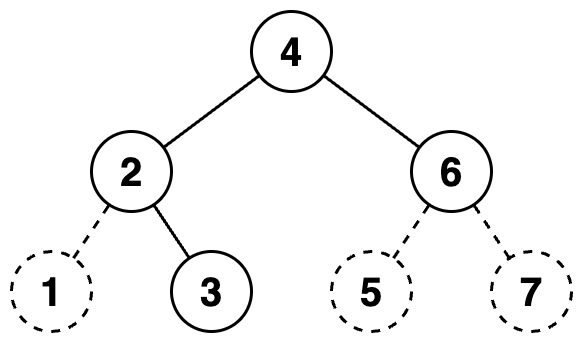

# 문제 설명

당신은 이진트리를 수로 표현하는 것을 좋아합니다.

이진트리를 수로 표현하는 방법은 다음과 같습니다.

이진수를 저장할 빈 문자열을 생성합니다.

주어진 이진트리에 더미 노드를 추가하여 포화 이진트리로 만듭니다. 루트 노드는 그대로 유지합니다.

만들어진 포화 이진트리의 노드들을 가장 왼쪽 노드부터 가장 오른쪽 노드까지, 왼쪽에 있는 순서대로 살펴봅니다. 노드의 높이는 살펴보는 순서에 영향을 끼치지 않습니다.

살펴본 노드가 더미 노드라면, 문자열 뒤에 0을 추가합니다. 살펴본 노드가 더미 노드가 아니라면, 문자열 뒤에 1을 추가합니다.

문자열에 저장된 이진수를 십진수로 변환합니다.
이진트리에서 리프 노드가 아닌 노드는 자신의 왼쪽 자식이 루트인 서브트리의 노드들보다 오른쪽에 있으며, 자신의 오른쪽 자식이 루트인 서브트리의 노드들보다 왼쪽에 있다고 가정합니다.

다음은 이진트리를 수로 표현하는 예시입니다.

주어진 이진트리는 다음과 같습니다.


주어진 이진트리에 더미노드를 추가하여 포화 이진트리로 만들면 다음과 같습니다. 더미 노드는 점선으로 표시하였고, 노드 안의 수는 살펴보는 순서를 의미합니다.



당신은 수가 주어졌을때, 하나의 이진트리로 해당 수를 표현할 수 있는지 알고 싶습니다.

이진트리로 만들고 싶은 수를 담은 1차원 정수 배열 numbers가 주어집니다. numbers에 주어진 순서대로 하나의 이진트리로 해당 수를 표현할 수 있다면 1을, 표현할 수 없다면 0을 1차원 정수 배열에 담아 return 하도록 solution 함수를 완성해주세요.

## 제한사항

- 1 ≤ numbers의 길이 ≤ 10,000
  - 1 ≤ numbers의 원소 ≤ 10\*\*15

입출력 예
|numbers |result|
|---------|-------|
|[7, 42, 5]| [1, 1, 0]|
|[63, 111, 95]|[1, 1, 0]|

---

# 문제 풀이

- 분할 정복
- 주어진 십진수를 2진수로 변환
  - 포화이진트리에서 노드의 개수는 2 \*\* h - 1 이어야 하고, 현재 2진수가 포화 이진 트리를 가정하므로 2진수로 변환할 때의 문자열에서 모자란 개수만큼 앞에 `0` 을 붙이기
- 주어진 이진수에서 가운데 root 노드부터 아래로 탐색
  - 문제 조건에 따라 **더미노드는 나중에 추가된 노드이므로** leaf node가 아닌 노드에서 더미노드 인 경우가 발생해서는 안된다.
  - 정리: 부모노드가 더미노드이면서 자식 노드가 일반 노드인 경우는 표현 불가능한 이진트리
    - 다만 부모노드가 더미노드이면서 자식 노드가 모두 더미노드라면 표현 가능한 이진트리다.
  - `제한 사항` 에 따라 number 길이가 최대 10,000이므로 탐색을 하면서 표현 불가능한 이진트리가 나오는 경우 곧바로 back하고 탐색 중지

```javascript
function check(bits, root, status = 1) {
  // leaf node라면
  if (bits.length === 1) {
    // 이전 root node가 0이고 현재 노드가 1이라면
    // 표현 불가능한 이진트리
    if (status === 0 && bits[root] === "1") {
      return 0;
    }
    // 그 외는 모두 가능
    return 1;
  }
  // 이전 root 노드가 0인데 현재 노드는 1이라면 더 재귀하지 않고 return 0
  if (status === 0 && bits[root] === "1") {
    return 0;
  }

  let left = bits.slice(0, root);
  let right = bits.slice(root + 1);

  let leftChecked = check(
    left,
    Math.floor(left.length / 2),
    parseInt(bits[root])
  );
  let rightChecked = check(
    right,
    Math.floor(right.length / 2),
    parseInt(bits[root])
  );
  if (leftChecked === 0 || rightChecked === 0) {
    return 0;
  }
  return 1;
}

function solution(numbers) {
  var answer = [];
  // 10진수 -> 2진수 변환(앞에 '0'붙이기: 중위 순회 + 문제 조건에 따라 root 노드는 항상 가운데 있어야 하고, 전체 노드는 포화 이진 트리이므로 2 ** n - 1 개수만큼 있어야 한다.)
  // ** 더미노드는 나중에 추가된 노드이므로 leaf 노드가 있음에도 부모가 더미인 경우는 발생해서는 안된다. **
  // 노드가 1인 경우도 이진트리

  numbers.forEach((number) => {
    let bits = number.toString(2);
    let n = 0;
    while (2 ** n - 1 < bits.length) {
      n++;
    }
    bits = "0".repeat(2 ** n - 1 - bits.length) + bits;
    let root = Math.floor(bits.length / 2);
    let result = check(bits, root, parseInt(bits[root]));
    answer.push(result);
  });
  return answer;
}
```
