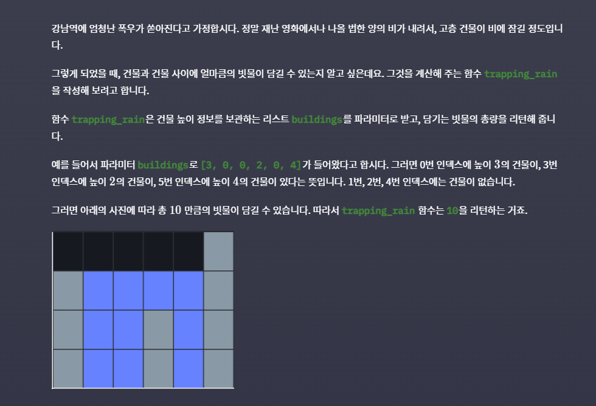

# 강남역 폭우 2

## 문제




이번에는 파라미터 `buildings`로 `[0, 1, 0, 2, 1, 0, 1, 3, 2, 1, 2, 1]`가 들어왔다고 합시다. 그러면 아래의 사진에 따라 총 66 만큼의 빗물이 담길 수 있습니다. 따라서 `trapping_rain` 함수는 `6`을 리턴하는 거죠.


## 풀이법 및 코드

- DP 적인 요소를 적용할 수 있음

- 현재 건물의 높이가 리스트로 주어진다.

- 현재 건물의 인덱스 왼쪽에 가장 큰 건물의 높이를 left_list[i]에 담는다.

- 현재 건물의 인덱스 오른쪽에 가장 큰 건물의 높이를 right_list[i]에 담는다.

  - left_list의 0번째 요소는 가장 첫 건물의 높이(왼편에는 더 높은 건물이 없다.)
  - right_list의 len(right_list)-1 번째 요소는 가장 마지막에 있는 건물 높이(오른편에 더 높은 건물이 없다.)

- left_list[i] 의 경우, left_list[i-1] 의 값(i-1번째 위치의 왼쪽에서 가장 큰 건물의 높이)과 건물높이 리스트[i-1] 를 비교(i-1번째 건물 높이, 현재 위치에서 바로 이전위치에 있는 건물 높이)

  - 인덱스 `i - 1` 왼쪽에서 제일 높은 건물의 높이(left_list[i-1])
  - 인덱스 `i - 1`의 건물 높이 (buildings_height[i-1])

  -  이 중 큰 값이 left_list[i]의 값이 된다.
  - right_list도 비슷하게 구하여 리스트를 완성한다.

- 현재 위치에서 채워질 수 있는 빗물의 양은 현재 i번째 위치 왼쪽에서 가장 큰 건물 높이(left_list[i]), 오른쪽에서 가장 큰 건물 높이(right_list[i]) 중 작은 건물 높이(min(left_list[i], right_list[i]))에서 현재 건물 높이를 빼면 남는 공간만큼 빗물이 채워진다.

  - 만약 현재 건물 높이가 가장 크다면,  현재 건물 위치의 빗물 양은 0으로 지정한다.

  

```python
def trapping_rain(buildings):
    total_height = 0 # 총 갇히는 비의 양을 담을 변수
    n = len(buildings)

    # 각각 왼쪽 오른쪽 최대값 리스트 정의
    left_list = [0] * n
    right_list = [0] * n

    # buildings 리스트 각 인덱스 별로 왼쪽으로의 최댓값을 저장한다
    left_list[0] = buildings[0]
    for i in range(1, n):
        left_list[i] = max(left_list[i-1], buildings[i-1])
                
    # buildings 리스트 각 인덱스 별로 오른쪽으로의 최댓값을 저장한다
    right_list[-1] = buildings[-1]
    for i in range(n - 2, -1, -1):
        right_list[i] = max(right_list[i+1], buildings[i+1])

    # 저장한 값들을 이용해서 총 갇히는 비의 양을 계산한다
    for i in range(1, n-1):
        # 현재 인덱스에 빗물이 담길 수 있는 높이
        upper_bound = min(right_list[i], left_list[i])

        # 현재 인덱스에 담기는 빗물의 양을 계산
        # 만약 upper_bound가 현재 인덱스 건물보다 높지 않다면, 현재 인덱스에 담기는 빗물은 0
        total_height += max(0, upper_bound - buildings[i])

    return total_height


print(trapping_rain([3, 0, 0, 2, 0, 4]))
print(trapping_rain([0, 1, 0, 2, 1, 0, 1, 3, 2, 1, 2, 1]))
```


