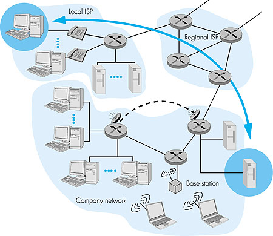
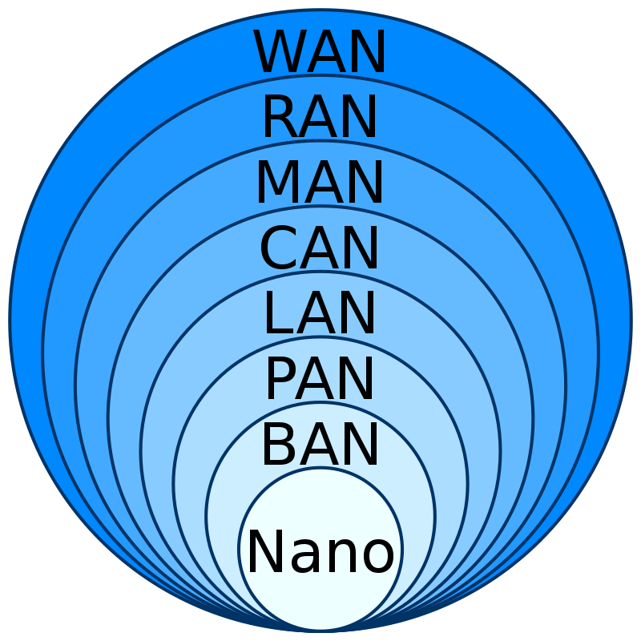
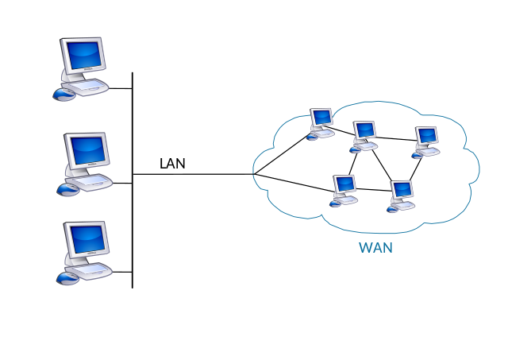

# Network

> **컴퓨터 네트워크**(computer network) 또는 **컴퓨터망**([문화어](https://ko.wikipedia.org/wiki/문화어): 콤퓨터망)은 [노드](https://ko.wikipedia.org/wiki/노드_(네트워크))들이 자원을 공유할 수 있게 하는 [디지털](https://ko.wikipedia.org/wiki/디지털_신호) [전기통신망](https://ko.wikipedia.org/wiki/통신_네트워크)의 하나이다. 즉, 분산되어 있는 [컴퓨터](https://ko.wikipedia.org/wiki/컴퓨터)를 통신망으로 연결한 것을 말한다. 컴퓨터 네트워크에서 [컴퓨팅 장치](https://ko.wikipedia.org/wiki/컴퓨터)들은 노드 간 연결([데이터 링크](https://ko.wikipedia.org/wiki/데이터_링크))을 사용하여 서로에게 [데이터를 교환](https://ko.wikipedia.org/wiki/데이터_전송)한다. 이 데이터 링크들은 유선, 광케이블과 같은 [케이블 매체](https://ko.wikipedia.org/w/index.php?title=네트워크_케이블&action=edit&redlink=1), 또는 [와이파이](https://ko.wikipedia.org/wiki/와이파이)와 같은 [무선 매체](https://ko.wikipedia.org/wiki/무선_네트워크)를 통해 확립된다.
>
> wikipedia

- 종단 시스템(End system): PC나 스마트폰처럼 네트워크 송수신 주체

from Computer Networking: A Top-Down Approach Featuring the Internet Chapter 2 

- 프로토콜: 두 이종 시스템을 연결하기 위한 **규약**
- 통신을 목적으로 실제 물리적으로 선으로 연결되어 있거나 무선으로 연결됨

## 인터넷

- 전세계적으로 연결된 컴퓨터 네트워크 시스템
- 네트워크의 대표적인 예시가 인터넷
  - 소규모 네트워크와 전 세계 네트워크가 연결되어 있는 상태
- 연결되어 있는 여러 컴퓨터는 각각 클라이언트와 서버로 구성되며, TCP/IP 프토토콜로 통신이 이루어진다.
- End system은 보통 ISP(Inter Service Provider)에 의해 연결되어 있음

## 네트워크 통신

- 노드 간 연결을 통해 데이터를 교환하는 과정

- 데이터는 텍스트, 이미지, 영상 등을 포함한다.

- 기본 동작
  1. 요청(request) : 송신하는 종단 장치에서 상대방에 서비스를 요청한다.
  2. 인지(idicate) : 수신하는 장치에서 작업 요청(이벤트)를 확인한다.
  3. 응답(response) : 수신하는 장치에서 요청받은 작업에 대해 적절히 응답한다.
  4. 확인(confirm) : 송신 측에서 응답 데이터를 최종적으로 확인한다.
- 처리량(throughput) : 링크를 통해 전달되는 단위 시간 당 데이터양
  - 단위로는 bps(bits per second, 초당 전송 또는 수신되는 비트 수)사용
  - 트래픽, 네트워크 장치 간 대역폭, 장치의 하드웨어 스펙 등에 영향을 받음
  - 대역폭: 주어진 시간 동안 네트워크 연결을 통해 흐를 수 있는 최대 비트 수
- 지연 시간(latency) : 요청이 처리 되는 시간
  - 어떤 메시지가 두 장치 사이를 왕복하는 데 걸린 시간
  - 매체 타입(유선, 무선), 패킷 크기, 라우터의 패킷 처리 시간 등에 영향을 받음

## 네트워크 유형

**LAN**(Local Area Network)

- 일정 그룹의 지역 네트워크(집, 사무실, 학교 등)
- 소규모로 묶이며 사설망등을 구축해 연결

**WAN**(Wide Area Network)

- 원거리 통신망으로 넓은 범위 연결(국가, 대륙 등)

## 네트워크 토폴로지(Network topology)

- 물리적 토폴로지
  - 네트워크를 구성하는 요소들이 물리적으로 연결되어 있는 배치 형태
  - 연결 비용, 확장성, 유연성, 대역폭 등에 영향
- 논리적 토폴로지
  - 노드 간 데이터 흐름의 형태
  - 패킷 손실, 혼잡 제어 등에 영향

### 링형(Ring Topology)

- 기기와 기기 간 연결이기 때문에 회선 설치가 수월하다.
- 그러나 한 장비가 불량이 되면 통신이 어려워짐

### 버스형(Bus Topology)

- 하나의 메인 회선(버스)을 설치하고, 해당 회선에 단말을 달아놓는 형태

  ex) 학교 전산망

### 스타형(Star Topology)

- 중앙에 허브가 있고 이 허브에 모든 기기가 포트 별 형태로 연결되어 있는 형태
- 허브의 포트 위치에 따라 회선을 연결해야 하므로 회선 설치가 다소 어려움

### 매쉬형(Mesh Topology)

- 하나의 장비가 여러 회선을 가지고 여러 기기에 연결되어 있는 형태
- 통신 속도가 빠르고, 한 기기가 고장나도 다른 기기로 통신이 가능
- 데이터를 보낼 수 있는 경로가 많음
- 네트워크를 설치하는 비용이 많이 든다.

### 트리형(Tree Topology)

- 노드들이 계층적으로 연결되어 있는 형태
- 주로 WAN에 적용되는 형태
- Bus형과 Star형의 확장형
- 더 많은 기기와 연결하기 쉬움(확장성이 좋음)
- 관리 및 유지 보수가 편함
- 네트워크에서 에러를 감지하기에 용이
- 다른 토폴로지형에 비해 비용이 비쌈
- 루트 노드에 문제가 생기면 네트워크 전체가 붕괴

### 하이브리드형(Hybrid Topology)

- 두 가지 이상의 토폴로지 형태를 결합한 형태
- 유연한 네트워크 토폴로지 형태이지만 비용이 다소 비쌈
- 네트워크 크기를 쉽게 확장 가능
- 설계하기가 어려움

# References

- 패스트캠퍼스 컴퓨터 네트워크 강의
- https://ko.wikipedia.org/wiki/%EC%BB%B4%ED%93%A8%ED%84%B0_%EB%84%A4%ED%8A%B8%EC%9B%8C%ED%81%AC#
- https://www.ibm.com/docs/ko/aix/7.2?topic=management-network-communication-concepts
- https://en.wikipedia.org/wiki/Internet