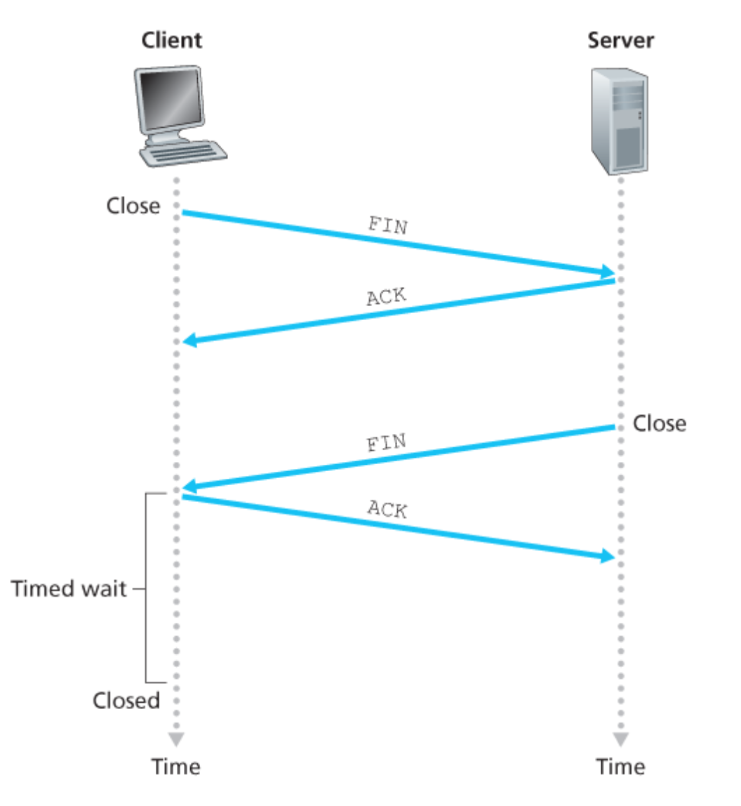

# TCP
- 연결 위주(가상 회선) 전송 방식(Connection-oriented) 
  - 전송 데이터의 신뢰성과 무결성을 보장하기 위한 것
- 신뢰성 있는 전송
  - TCP 연결 경로를 통하여 데이터를 전송하고 이에 대한 응답(ack)을 받음으로써 그 데이터가 올바르게 전송되었음을 보장
- 데이터 흐름 제어나 순서 제어를 하기 때문에 전송 속도가 느리다.
- 양방향 연결(가상회선 연결방식)
- 통신 버퍼를 이용한 전달 및 특별한 구조가 없는 **바이트 스트림** 형태로 수송

## 바이트와 세그먼트
- 다수의 바이트를 묶어서 세그먼트로 그룹화
- 각 세그먼트에 헤더를 붙이고 전송을 위해 IP 계층으로 전달

## TCP connection
- full-duplex service 제공 -> 서로 다른 호스트의 프로세스가 데이터를 동시에 주고 받을 수 있음
- point-to-point 연결
  - a single sender, a single receiver

### send buffer & recive buffer

- 송신 측 TCP는 buffer에서 데이터 청크(세그먼트)를 network layer로 전송되어 IP datagram으로 캡슐화
- MSS(Maximum Segment Size)는 호스트가 전송 가능한 가장 큰 link layer 프레임의 길이에 따라 결정된다.(MTU, maximum transmission unit)
  - Ethernet과 PPP link-layer 프로토콜의 MTU는 1500 bytes
  - 주의) MSS는 TCP 세그먼트 내 Application layer 데이터의 최대 사이즈를 의미(TCP segment의 헤더를 포함한 세그먼트의 최대 사이즈를 의미하지 않음)
  - 예를 들어, 이미지 파일처럼 용량이 큰 데이터의 경우에 MSS 길이에 따라 데이터 청크가 나누어지고, 나누어진 청크가 buffer에 들어간다.

### TCP segments structure

- Seguence number
  - 세그먼트를 MSS에 맞게 나눌 때, 순서대로 데이터를 주고 받기 위해 표기하는 숫자 필드
- Acknowledgment number
  - 수신측에서 수신을 대기하고 있는 데이터 청크의 sequence number
  - 순서대로 데이터를 받으면서 현재 받은 데이터 청크의 다음 시퀸스 넘버를 상대 측에 보내는 세그먼트에 기입하여 전송한다.

- flag
  - SYN, FIN : TCP 연결을 하거나 중단할 때 사용하는 필드
  - CWR, ECE : 혼잡(congestion) 제어에 사용되는 필드
  - PSH : 즉시 데이터를 상위 레이어로 전송해야할 때 사용하는 필드, 버퍼가 다 채워질 때까지 기다리지 않음
  - URG : 송신 측 상위 레이어 개체에서 urgent로 마크된 데이터가 현재 세그먼트 내에 있음을 알리는 필드
    - urgent data pointer: urgent data의 마지막 byte를 표시해주는 16-bit field

### 3-way handshake
- TCP connection을 하는 작업 
  

1. 클라이언트가 서버로 SYN을 보냄
2. 서버가 응답으로 SYN, ACK 신호를 보낸다.
3. SYN, ACK을 정상 수신하면 응답으로 다시 ACK을 보낸다.
4. 연결이 훼손되는 경우, RST 세그먼트를 전송하여 연결 중지

**연결이 훼손되는 경우**
- 한쪽 TCP가 존재하지 않는 포트에 대해 연결 요청을 받은 경우 
- 한쪽 TCP가 비정상적인 상황으로 인해 연결 중지를 원할 경우
### 4-way handshake
- TCP connection을 해제하는 작업
 

- timed wait을 하는 이유?
  - client가 보낸 ACK가 중간에 소실되어 server 측으로 전송되지 않았을 때, client는 ACK를 재전송해야 함
  - 따라서 ACK를 보낸 후 대기 시간(server에서 ACK를 받기에 충분하다고 여겨지는 시간) 상태로 진입하고, 별다른 이상이 없으면 그대로 연결 close

## 데이터 전송 방식
- Reliable data transfer service
- 기본적으로 패킷에 시퀸스 넘버를 붙여서 수신 측에 전달
- 수신 측은 송신 측으로부터 이어서 받을 다음 패킷의 시퀸스 넘버를 ACK과 함께 전송

### timer
- 재전송 타이머(Retransmission timer)
- 영속 타이머(Persistence Timer)
- 연결 유지 타이머(keep-alive timer)
- 시간 대기 타이머(time-waited timer)

## Flow control
- 수신자가 받을 수 있는 바이트 수만큼 데이터를 전송
- 슬라이딩 윈도우 프로토콜을 사용하여 송신자가 전송할 수 있는 데이터 양을 정의
  - 슬라이딩 윈도우 : 데이터 흐름을 제어 & 전송 효율화, 바이트 단위로 제어
  - 윈도우의 크기 : receiver window(rwnd)와 congestion window(cwnd) 중 작은 값으로 결정
  - 데이터를 송신하면 송신 측의 슬라이딩 윈도우가 왼쪽부터 하나씩 줄어들고, 수신 측에서 ACK응답을 받으면 송신 측의 슬라이딩 윈도우는 오른쪽으로 한 칸 늘어난다.
    
  

## Error control
- checksum, ACK, time-out 활용
- 세그먼트가 손실되는 경우 : 최종 목적지 혹은 중간 목적지에서 폐기 후 송신측에서 세그먼트 재전송
  - 3-ACK duplicated 정책에 의해 3번 같은 ACK을 받은 송신자가 해당하는 세그먼트를 재전송
  -  시간이 만료되기 전에 패킷을 재전송하므로 빠른 재전송이라고 부르며, 3-ACK duplicated 를 받은 송신 측은 네트워크가 혼잡하다고 감지하여 혼잡 제어를 실행
- 세그먼트가 중복된 경우
  - 수신자의 ACK이 송신자의 시간 종료 전에 도착하지 못했을 때, 송신 측이 세그먼트를 재전송하여 발생
  - 동일 시퀸스 넘버의 세그먼트에 대해서 수신자는 해당 세그먼트를 폐기
- 세그먼트의 순서가 어긋난 경우
  - 세그먼트가 순서대로 도착하지 않았을 경우에 발생
  - 다음 순서에 대한 세그먼트가 도착할 때까지 수신자는 ACK 응답 지연
    - time-out된 수신자는 알맞은 순서의 세그먼트를 재전송
  

## Congestion control
- 송신 측에서 congestion window(cwnd)를 사용하여 구현
- 네트워크에 많은 패킷이 전송되어 과부하가 일어나는 상황을 방지
  

### AIMD(additive-increase, multiplicative-decrease)
- 윈도우 사이즈를 1씩 늘리다가 패킷 로스가 발생하면 윈도우 사이즈를 반으로 줄인다.
- 모든 호스트가 공평하게 네트워크를 사용할 수 있음
  - 네트워크를 기존에 사용하던 호스트는 많은 패킷을 보내다가 유실되면서 사이즈 감소
  - 새로 참여한 호스트는 남은 대역폭을 활용하여 패킷을 전송
- 조금씩 사이즈를 늘리기 때문에 네트워크 대역폭을 최대로 활용하기 어려움

### Slow start

  1. 처음에는 1 MSS만큼 데이터를 보낸다.
  2. ACK 응답을 받으면 2 MSS 데이터를 보낸다.
  3. 4 MSS, 8 MSS ... 지수곱으로 점차 윈도우 사이즈를 늘린다.
  4. ssthresh에 도달할 때까지 계속 증가한다.
  5. 혼잡 없이 윈도우 사이즈가 ssthresh에 도달하면 혼잡 회피 모드로 진입한다.(congestion avoidance mode)

- congestion이 감지되는 경우
  - time-out
  - 3-duplicated ACK 

### Congestion avoidance
- TCP Tahoe(Fast retransmit 도입)
  1. Slow start로 사이즈를 계속 늘린다.
  2. 임계점에 도달하면 선형적으로 사이즈를 늘린다.
  3. 혼잡이 감지되면 MSS를 1로 줄이고, ssthresh도 이전 윈도우 사이즈의 반으로 줄인다.
  4. time-out과 triple-duplicated ACK 중 하나가 발생해도 MSS를 1로 줄인다.
  
- TCP Reno(Fast recovery 도입, 3-dup ACK와 time-out 구분)
  1. TCP Tahoe와 비슷한 방식으로 윈도우 사이즈와 ssthresh를 늘리고 줄인다.
  2. 단, 3-duplicated ACK가 발생한 경우에는 MSS를 1로 줄이지 않고 감지된 시점의 cwnd 사이즈에서 반으로 줄이고 1씩 사이즈를 늘린다.(fast recovery)
  3. timeout이 발생하면 윈도우 사이즈를 1 MSS로 줄인다.
    

이외에도 TCP Vegas, Westwood, BIC, CUBIC 등이 있다.

# References
https://d2.naver.com/helloworld/47667

Computer Networking _ A Top Down Approach, 7th

패스트캠퍼스 컴퓨터 네트워크 강의 - 황영덕 