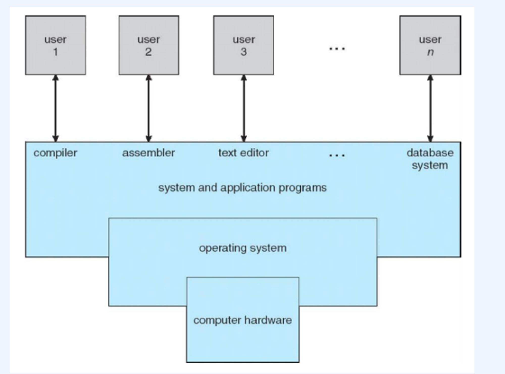
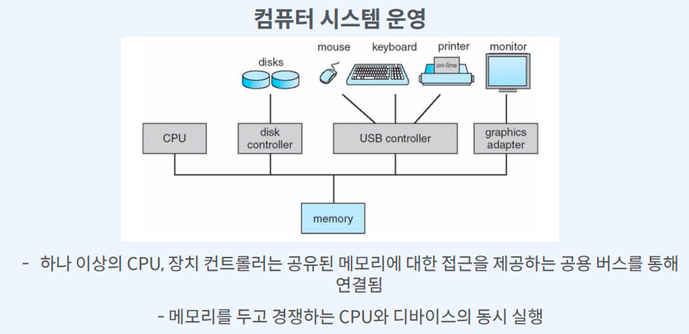

# 운영체제란?

- 컴퓨터 시스템 4가지 구성 요소 중 하나
  - 4가지 구성 요소
    - 하드웨어(CPU, 메모리, I/O 장치)
    - 운영체제
    - 응용 프로그램
    - 사용자
      

## 운영체제의 역할

- 사용자와 하드웨어 혹은 응용 프로그램과 하드웨어 사이에서 중간자 역할
- 사용자가 사용하는 응용 프로그램이 효율적으로 적절하게 동작하도록 지원

1. 시스템 자원(리소스) 관리
   - 리소스 할당의 주체
   - 자원에 대한 충돌되는 요청 사이에서 효율적이고 공정하게 사용 리소스를 분배
2. 사용자와 컴퓨터 간 커뮤니케이션 지원
3. 컴퓨터 하드웨어와 프로그램 제어
   - 프로그램 실행을 제어, 오류 및 부적절한 사용 방지
   - 컴퓨터 하드웨어는 OS의 도움 없이 동작하기 어려움
     - `CPU`: 각 프로그램이 얼마나 CPU를 사용할지를 결정할 수는 없다.
     - `Memory` : 각 프로그램이 어느 주소에 저장되어야 하는지, 어느 정도의 메모리 공간을 확보해야 하는지 메모리 스스로 결정할 수 없다.
     - `저장매체(HDD, SSD)`: 어떻게, 어디에 저장할 지 결정할 수 없음 -`키보드/마우스`: 스스로 표시할 수 없음
4. 응용프로그램 관리
   - 응용 프로그램 간 권한뿐만 아니라 응용 프로그램을 사용하는 사용자 모두 관리

## 운영체제의 요소

- 커널

  - 컴퓨터에서 항상 실행되는 하나의 프로그램

- 시스템 프로그램
  - 시스템 운영과 관련 있는 응용 프로그램

## 부트스트랩(Bootstrap, 부팅)

- PC의 전원버튼을 누른 직후부터, 운영체제가 메모리에서 동작하기 시작할 때까지의 모든 과정

- 사용자가 PC의 전원을 누르고 OS가 메모리 상에서 동작하기 시작하기 직전까지의 과정

### 부팅 과정

1. 메인보드에 전력 공급

2. ROM or EEPROM에 저장된 BIOS 루틴이 시작

3. BIOS는 셀프테스트를 통해 주변 하드웨어를 체크

4. MBR(Master Boot Record)에 존재하는 부팅 정보를 읽어오는 부트스트랩 실행

5. 전기 신호가 꺼지면 저장 정보가 휘발되는 RAM에 Bootloader를 적재, 디스크에 있는 OS(커널)코드를 복사하여 메모리에 적재 및 초기화

> MBR은 메모리가 아닌 디스크 위에 있음

## 입출력 장치와 하드웨어

- 입출력 장치, CPU는 동시 실행 가능
- 각 장지 컨트롤러는 특정 디바이스 유형 및 로컬 버퍼 존재

- 특정 디바이스 : 디스크 - 디스크 컨트롤러, 모니터 - 그래픽스 어댑터 등

- CPU는 메인 메모리 -로컬 버퍼 간 데이터 이동
- 입출력은 장치에서 컨트롤러의 로컬 버퍼로 데이터 전달
- 장치 컨트롤러는 **인터럽트**를 발생시켜 CPU에 작업 완료를 알림
  

## 참고

패스트캠퍼스 컴퓨터 공학 올인원 패키지 - 김혜겸
패스트캠퍼스 컴퓨터 공학 올인원 패키지 - 이준희
