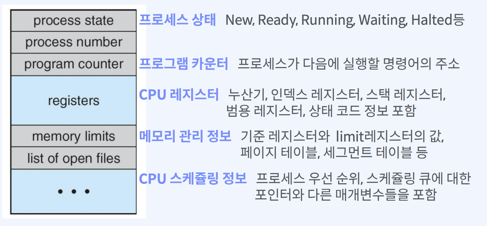

# PCB

- Process Control Block
- 각각의 프로세스는 운영체제에서 PCB에 의해 표현된다.
- 프로세스가 실행 중인 상태를 캡쳐 및 구조화해서 저장
- 구성 요소
  - Process ID
  - Registers (PC, SP 등 CPU 레지스터들)
  - Scheduling Info(Process State)
  - Memory Info(메모리 사이즈 limit)

### CPU 레지스터

- CPU 내 임시 저장 장치
  - CPU 혹은 MPU에 내장
  - 명령, 주소, 데이터를 임시 보관하는 고속 기억 장치

http://www.ktword.co.kr/test/view/view.php?m_temp1=5269

---
