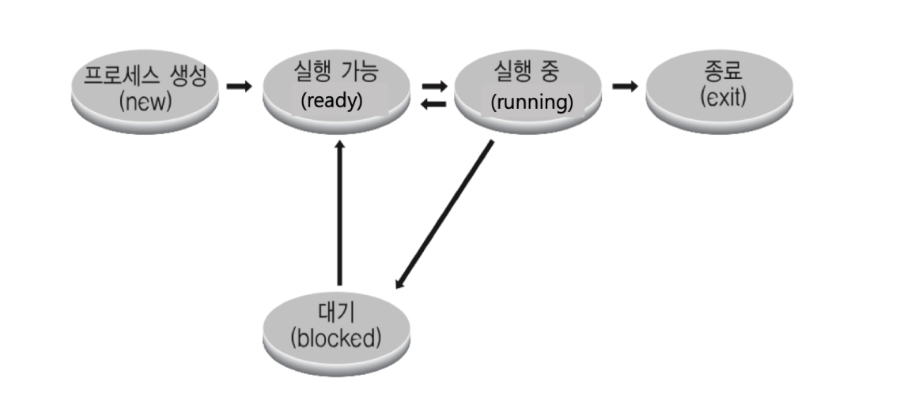

# 프로세스

- 메모리에 적재되어 실행 중인 프로그램
- 프로그램 -> 메모리 적재 -> 프로세스
- 응용 프로그램이 반드시 하나의 프로세스만 가리키는 것은 아니다.
  - 프로그램 하나에 여러 프로세스가 실행될 수 있음

## 프로세스 구조


- DATA는 BSS 세그먼트와 DATA 세그먼트로 분리됨
  - BSS : 초기값이 없는 전역 변수 관리
  - DATA : 초기값이 있는 전역 변수 관리

### 프로그램 컴파일 예시


- 코드 영역에 소스 코드 저장
- 데이터 영역에 변수 선언한 부분 저장(함수 바깥에 변수 선언한 부분이 저장된다.)
  - 변수는 메모리의 특정 주소를 가리킴
  - 그 메모리 주소에 데이터 값 저장
- 함수가 호출되면

  - return address를 stack 영역에 저장
  - 리턴 주소 아래에 함수 인자를 순차적으로 저장
  - 처리가 모두 끝나면 아래에서부터 영역을 비움
  - 코드 영역의 함수 호출 다음 부분 실행

- 함수 내부에 함수가 호출되면
  
  
  - stack에 함수가 호출되고 나서의 return address가 차례차례 쌓인다.
  - 나중에 호출된 함수가 먼저 처리된다.

### 주오 레지스터

PC(Program Counter) + SP(Stack Pointer)

- PC와 SP는 `PCB(Process Context Block)`에 저장된다.
  - PCB: 프로세스의 실행 상태를 캡쳐 및 구조화하여 저장
- PC는 코드를 하나 하나 가리킨다.
- SP는 stack 영역의 top에 해당하는 주소를 가리킨다.

- EBP
  - 현재 Stack의 최상단 주소
  - stack pointer의 최상단 값을 stack과 EBP에 저장한다.
  - 함수가 호출되면 EBP 값 아래에 return address와 함수 파라미터, 함수 내부 지역변수 값들이 stack에 저장된다.
    - 그 다음 영역 주소가 EBP가 가리키는 주소값이 된다.
- EAX
  - 함수의 반환값을 저장
  - stack에서 함수 호출부 마지막 리턴 어드레스가 지워지고 PC가 함소 호출 다음 코드를 가리킬 때, 함수의 반환값을 받는 변수가 있으면 해당 변수가 반환값을 가리킴
- **EBP를 쓰는 이유?**
  - 함수 내부에 함수를 호출하거나 여러 함수를 호출하는 경우, 이 함수들을 구분하기 위한 장치가 필요하다.


### heap 예시

```c
#include <stdio.h>
#include <stdlib.h>

int main(){
  int *data;
  data = (int*) malloc(sizeof(int));
  *data = 1;
  printf('%d', *data);
  return 0;
}
```


1. malloc으로 동적 할당한 int 자료형 만큼의 저장 공간(4 bytes)을 가리키는 메모리 주소를 data에 저장하고 data를 stack에 추가
2. 이때 malloc 동적 할당한 주소는 heap 영역의 어느 한 주소를 가리킨다.
3. 처음 동적할당할 때에는 쓰레기값이 heap에 적재됨

 4. `*data=1` 코드가 실행되면 data가 가리키는 heap영역의 주소에 정수 1이 값으로 저장된다.

## 프로세스 상태



- **running state**: 현재 CPU에서 실행하고 있는 상태

- **ready state**: CPU에서 실행 가능한 상태(실행 대기 상태)

- **block state(blocking 또는 waiting)**: 특정 이벤트 발생 대기 상태, 즉 wait 상태

  - 특정 이벤트가 발생되기 전까지는 wait(프로세스가 멈춘 상태)

  - 프로세스가 저장매체에서 파일 읽기를 하는 동작을 실행시키면, 프로세스는 파일 읽기가 완료 될 때까지 대기 상태로 돌입 => blocking 상태
  - 파일 읽기가 완료되면 특정 이벤트가 프로세스에 발생시켜서 프로세스 상태를 실행 가능한 상태로 변경

- **exit** : 프로세스가 종료되면서 잡고 있던 시스템 자원을 풀어주는 상태

- 기본적으로 3개의 상태(running, ready, block)가 스케줄러 알고리즘에서 고려하는 프로세스 상태
- 최신 스케줄링 알고리즘에서는 프로세스 상태를 잘게 쪼개는 등 매우 복잡하다.

### 프로세스 상태 간 관계 예시


- dispatch: ready 상태의 프로세스를 running 상태로 바꾸는 것
- interupt: 프로그램을 실행 중에 입출력 하드에워 등의 장치나 예외상황이 발생하여 처리가 필요할 경우 발생


- **process blocks for input** : input(특정 이벤트) 대기 상태

- **Scheduler picks another process** : ready 상태인 다른 프로세스를 pick해서 실행 상태로 변경
- **Scheduler picks this process** : 시분할 시스템처럼 특정 시간마다 다른 프로세스를 실행 상태로 변경시키고 현재 프로세스는 잠시 ready 상태로 변경(응답 시간을 줄이기 위해)

## 참고

패스트캠퍼스 컴퓨터 공학 올인원 패키지 교재 - 김혜겸

패스트캠퍼스 컴퓨터 공학 올인원 패키지 교재 - 이준희
