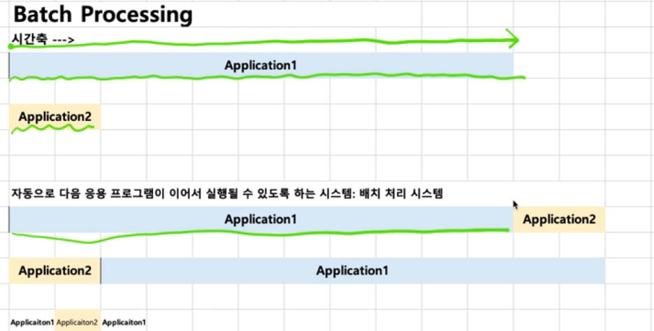
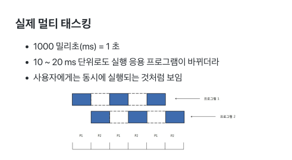
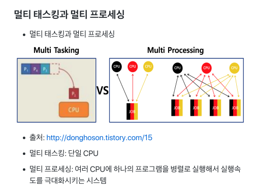
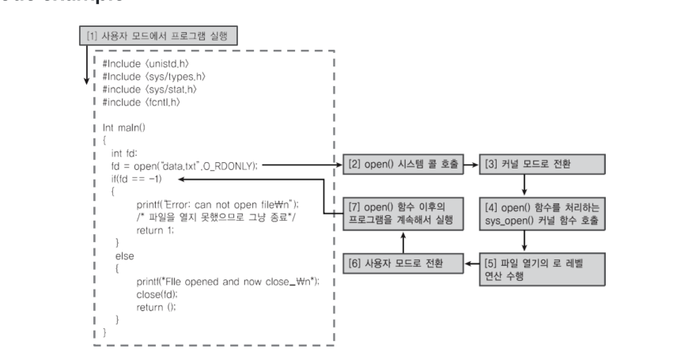
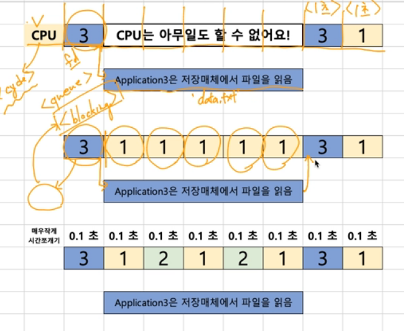
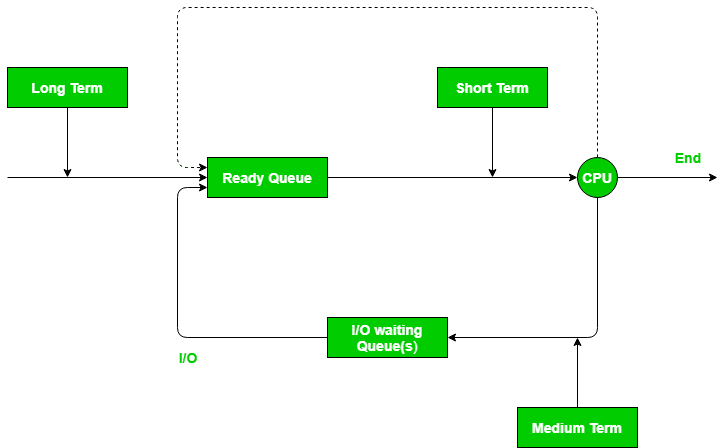
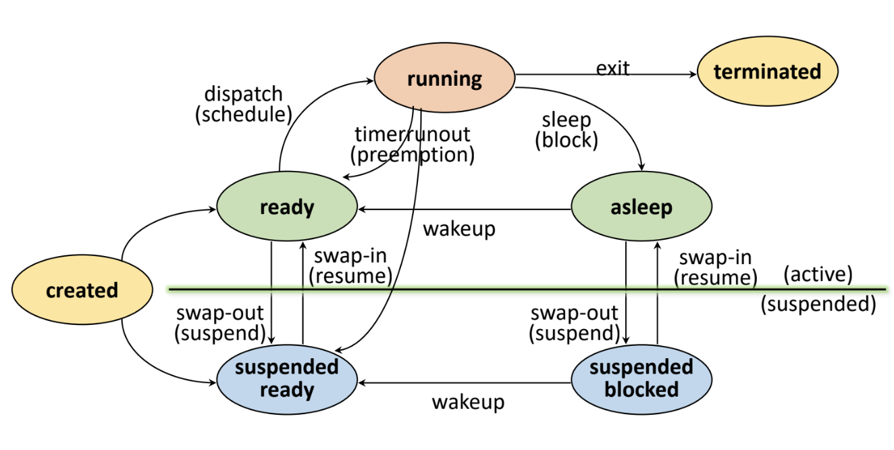
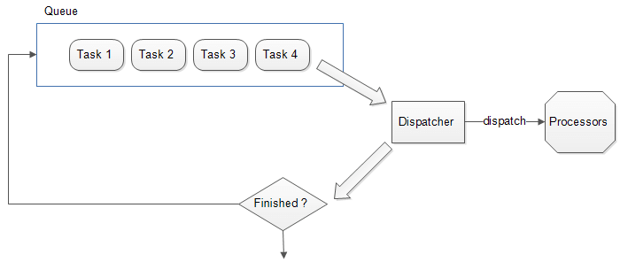
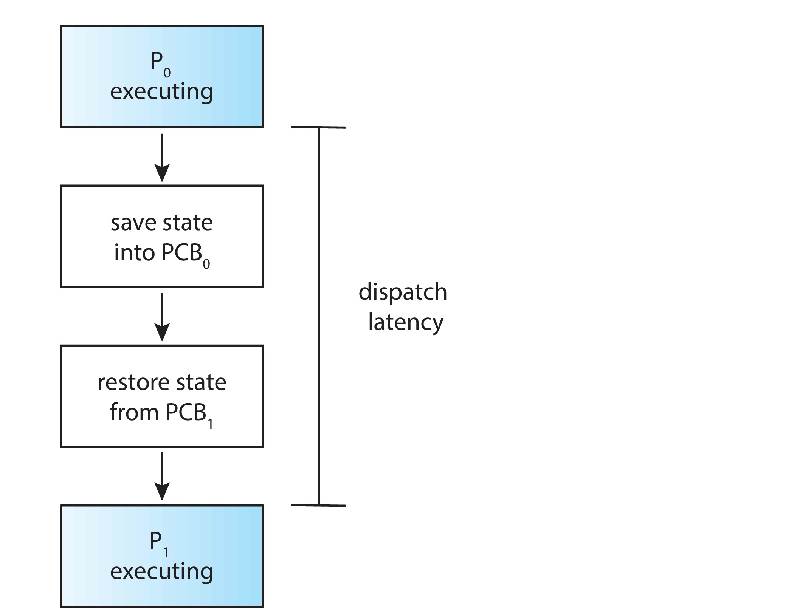

# 운영체제 시스템 변천사

## 일괄 배치 처리 시스템

- batch processing system
- Queue 자료구조와 비슷한 방식으로 컴퓨터 프로그램의 실행 요청 순서에 따라 순차적으로 프로그램을 실행하는 방식
- 한번에 등록된 여러 프로그램을 순차적으로 실행
  - 처음에는 수동으로 다음에 실행할 프로그램을 지정하는 방식이었다가, 이후에 자동으로 프로그램을 실행시키는 시스템으로 발전
- 단점
  - 실행 시간이 오래 걸리는 프로그램이 있으면, 해당 프로그램이 끝날 때까지 다른 프로그램을 실행할 수 없다.
  - 동시에 여러 프로그램을 실행하거나(동시성), 여러 사용자를 지원(다중 사용자)하지 못한다.

## 시분할 시스템

- Time sharing system
- **다중 사용자 지원**을 위해 컴퓨터 응답 시간을 최소화
- (여러 사용자가 실행하는) 응용 프로그램이 CPU를 점유하는 시간을 각각 나누어 실행될 수 있도록 하는 시스템
- 다중 프로그래밍을 전제로 함

## 멀티 테스킹

- Multi tasking
- **단일 CPU**에서 여러 응용 프로그램이 짧은 시간 안에 번갈아 실행되면서 마치 여러 응용 프로그램이 동시에 실행되는 것처럼 동작
- 동시성과 관련
  

## 멀티 프로세싱

- Multi processing
- 여러 CPU에서 하나의 프로그램을 병렬로 실행하키는 시스템
- 멀티 테스킹과의 차이점
  - 멀티 테스킹은 **단일 CPU**에서 여러 응용 프로그램을 실행
  - 멀티 프로세싱은 **여러 CPU**가 병렬로 프로그램을 실행
    

## 멀티 프로그래밍

- 최대한 CPU를 많이 활용하는 것이 목적
- 시간 대비 CPU 활용도를 높임

### example) open()

- open() 시스템 콜을 호출하면, 저장매체에서 파일을 읽어올 때까지 open() 함수 이후의 코드를 실행할 수 없다.
  

- 파일을 읽어오는 동안(프로세스가 block 상태일 동안) 다른 응용 프로그램을 실행하여 CPU 활용도를 높인다.
  

# OS scheduler

### 종류

- 단기(short term) 스케줄러 : 메모리에 적재된 실행 가능한 프로세스 중 어떤 프로세스에 CPU를 할당할 것인가?
- 중기(mid term) 스케줄러 : 메모리에 적재된 프로세스 중 어떤 프로세스를 메모리에서 내보낼 것인가?
- 장기(long term) 스케줄러 : 실행해야하는 작업(job)들 중 어떤 작업을 ready queue에 넣을 것인가?(어떤 작업을 메모리에 적재할 것인가?)
  

+) 단기, 중기, 장기 용어는 스케줄러의 수행 시간 간격을 기준
단기 스케줄러 -> 수행 시간 term이 짧은 스케줄러
장기 스케줄러 -> 수행 시간 term이 긴 스케줄러

- 단기 스케줄러 : Ready - Running(kernel mode)
- 중기 스케줄러 : Ready - Suspend & Ready, Block - Suspend & block
- 장기 스케줄러 : New(Created) - Ready

### 단기 스케줄러

- CPU 스케줄러
- CPU에서 실행 가능한 여러 프로세스들 중 하나의 프로세스를 선택하여 자원 할당
- 일반적으로 스케줄러는 단기 스케줄러를 의미(CPU와 메모리 사이 스케줄링)
- 어떤 프로세스를 선택하여 실행할 것인가? -> 스케줄링 알고리즘
- CPU의 대기시간을 최소화하여 이용률을 높이는 것이 스케줄링 알고리즘의 목적

### 중기 스케줄러

- 스와핑으로 메모리에서 프로세스를 제거하여 메모리 상의 프로세스 수를 완화

  - 프로세스 당 메모리 보유량이 극도로 적어지면 CPU 수행에 필요한 프로세스의 주소 공간도 메모리에 올리기 어려워짐 -> 해당 프로세스가 메모리에 없기 때문에 디스크에서 CPU 수행에 필요한 프로세스의 정보를 가져와서 연산을 한 후, 결과를 다시 디스크에 저장해야 함 -> 속도가 느린 디스크 I/O가 수시로 발생 -> 시스템 성능에 악영향
  - 위 문제를 해결하기 위해 중기 스케줄러는 스와핑으로 메모리에 적재된 프로세스 중 일부의 메모리를 통째로 빼앗아 해당 내용을 디스크의 스왑 영역에 저장

- swap out

  - 중지 상태(suspended)의 프로세스 메모리를 통째로 빼앗아 디스크의 스왑 영역에 저장
  - suspended block
    - block 상태의 프로세스가 중기 스케줄러에 의해 디스크로 swap out되어 suspended blocked 상태로 변화
  - suspended ready
    - block 상태의 프로세스를 중지시켜도 문제 해결이 되지 않는 경우, ready queue로 적재되는 프로세스의 메모리를 모두 swap out

- swap in
  - 메모리에 여유가 생기면 프로세스를 메모리에 다시 적재

+) 디스크 I/O 과정 요약
입력 -> 메모리 -> 인터럽트 -> buffer -> 디바이스 컨트롤러 -> 디스크
디스크 -> 디바이스 컨트롤러 -> buffer -> 인터럽트 -> 메모리 -> 결과 출력

### 장기 스케줄러

- 잡 스케줄러
- 디스크에 있는 프로그램(혹은 다른 job pool) 중 어떤 프로그램을 ready queue에 적재할 것인지 결정(메모리에 적재된 순간 프로세스 ready 상태 진입)
- 메모리에 적재되는 프로세스 수를 제어
- 실행 빈도가 낮음
- I/O 중심 작업 + CPU 중심 작업의 적절한 혼합이 중요
- 과거에 프로세스 당 메모리 보유량을 최대한 확보하기 위해 사용되었으나, **현대 운영체제에서는 프로세스가 실행되면 장기 스케줄러 없이 바로 해당 프로세스에 메모리를 할당하여 ready queue에 적재(가상 메모리 기법 등 메모리 활용 기법이 발전했기 때문)**

## dispatcher

- cpu 스케줄링 기능에 포함되는 요소
- CPU를 할당받아 작업을 수행할 수 있도록 환경설정을 하는 커널 모듈
- cpu 제어를 단기 스케줄러가 선택한 프로세스에 전달(프로세스에 CPU 할당)
- 프로세스를 Ready 상태에서 Running 상태로 전이하는 역할(dispatching)
- 작업
  - 컨텍스트 스위치
  - 사용자 모드
  - 프로그램을 다시 시작하기 위한 사용자 프로그램의 적절한 위치로 이동
  - 요약) 현재 실행 중이던 프로세스의 context를 그 프로세스의 PCB에 저장하고, 새롭게 선택된 프로세스 context를 해당 프로세스의 PCB에서 복원하여 CPU를 넘기는 작업 수행

### dispatch latency(디스패치 지연)

- 디스패쳐가 하나의 프로세스를 정지시키고 다른 프로세스에게 CPU를 전달하기까지 걸리는 시간
- context switching 오버헤드
  

# References

패스트캠퍼스 컴퓨터 공학 올인원 패키지 교재 - 김혜겸

패스트캠퍼스 컴퓨터 공학 올인원 패키지 교재 - 이준희

https://inpa.tistory.com/entry/%F0%9F%91%A9%E2%80%8D%F0%9F%92%BB-multi-programming-tasking-processing

https://kosaf04pyh.tistory.com/191

https://dev.to/l04db4l4nc3r/the-dispatcher-4l4k
