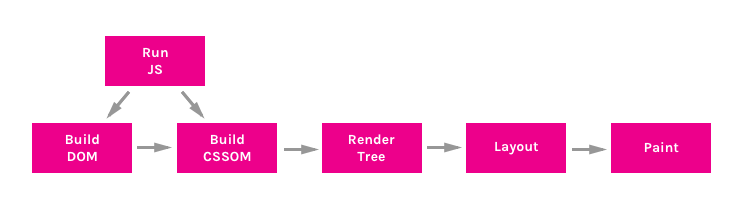
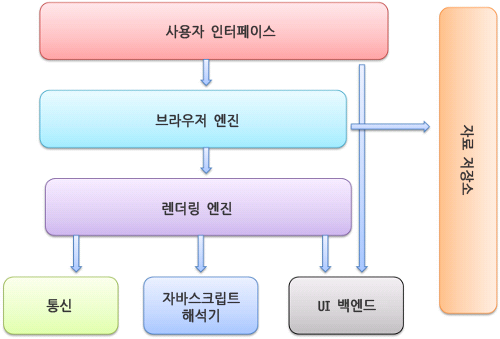

# 브라우저의 렌더링 동작 과정

[블로그 설명](https://puongcheol.tistory.com/entry/CS-%EB%B8%8C%EB%9D%BC%EC%9A%B0%EC%A0%80%EA%B0%80-%ED%99%94%EB%A9%B4%EC%9D%84-%EB%A0%8C%EB%8D%94%EB%A7%81%ED%95%98%EB%8A%94-%EC%9B%90%EB%A6%AC)

## TL;DR

1. HTML, CSS, JS parsing
2. Build DOM, Build CSSOM, Run JS
3. Construct Render Tree
4. Layout
5. Paint
6. Composite



[출처](ttps://bitsofco.de/understanding-the-critical-rendering-path/)


## 브라우저 구성 요소



- 렌더링은 브라우저의 렌더링 엔진이 담당
- 브라우저마다 사용하는 렌더링 엔진이 다름

## 1. Parsing

- DOM, CSSOM 을 구축하기 위한 파싱
  - HTML - parsing > DOM
  - CSS - parsing > CSSOM
- HTML 파싱 알고리즘
  - 토큰화
    - 열린 태그 -> 문자열 토큰 -> 닫힌 태그 
  - 트리 구축
    - insertion mode


## 2. Render Tree


[출처](https://web.dev/critical-rendering-path-render-tree-construction/)

- DOM + CSSOM
  - 화면에 실질적으로 표시할 요소들에 대한 정보와 순서를 구조화 시킨 트리
  - DOM의 각 노드에 CSSOM의 스타일 정보를 매칭
  - 반드시 DOM과 1대1 관계가 아님

- 과정
  1. DOM 트리의 root 노드에서 시작하여 화면에 표시되는 노드들을 탐색
  2. 각각의 시각적인 노드에 대해 CSSOM에서 적절한 스타일 규칙을 찾아 매칭
  3.  콘텐츠와 계산된 스타일로 각 노드들을 트리에 추가


## 3. Layout

- 브라우저 화면에 나타날 각 요소들의 위치와 크기 계산

- 배치 혹은 리플로우라고도 부름

- 레이아웃 작업이 일어날 수 있는 경우들

  ```
  1. DOM에 요소를 삽입, 제거 혹은 업데이트 하는 경우
  2. 페이지의 컨텐츠를 수정하는 경우(input 박스에 텍스트를 입력하는 등)
  3. DOM 요소를 이동시키는 경우
  4. offsetHeight이나 getComputedStyle과 같이 요소의 계산값을 취하는 경우
  5. CSS Style을 변경하는 경우
  6. 요소의 className을 변경하는 경우
  7. 스타일 시트를 추가하거나 제거하는 경우
  8. 브라우저 창을 리사이즈 하는 경우
  9. 스크롤 하는 경우
  ```

- 레이아옷 동작 과정
  1. 부모 렌더 객체가 자신의 너비를 결정
  2. 부모가 자식을 검토
     1. 자식 렌더 객체를 배치(자식의 x와 y를 결정)
     2. 필요하다면 자식 배치를 호출하여 자식의 높이를 계산
  3. 부모는 자식의 누적된 높이와 여백, 패딩을 사용하여 자신의 높이를 설정. 이 값은 부모 렌더 객체의 부모가 사용
  4. 더티 비트 플래그 제거


## 4. Paint

- 화면에 표시할 요소들을 픽셀로 변환하여 여러 레이어로 관리

- 복잡한 스타일이 있을 수록 Paint 시간이 늘어남


## 5. Composite

- 브라우저는 레이어를 여러 타일들로 쪼개어 GPU로 보내고, 이후에 이러한 타일을 모아서 화면에 컨텐츠를 그림

