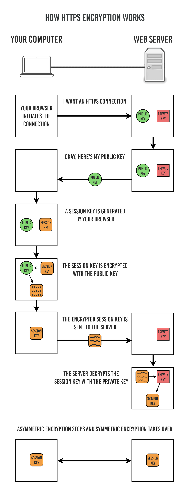

# HTTP, HTTPS

## HTTP(Hyper Text Transfer Protocol)

- Application 계층 프로토콜
- HTML 문서와 같은 리로스들을 가져올 수 있도록 하는 프로토콜
- 웹에서 이루어지는 모든 데이터 교환의 기초
- 특징
  - Stateless(무상태) : 서버가 클라이언트를 식별할 수 없음
  - Connectless(비연결성) : 서버가 응답을 마치면 연결을 해제
- Method, Path, Version, Header, Body 등으로 구성되어 있음
- HTTP 통신으로 request 수행 시, 암호화가 되지 않는 평문 데이터를 전송하기 때문에 중간에 패킷을 탈취당하면 암호가 노출될 위험이 있음

## HTTPS(Hyper Text Transfer Protocol Secure)

- HTTP 통신 보안 문제를 해결하기 위해 데이터 암호화 과정이 추가된 프로토콜
- 443번 포트 사용
- 제 3자가 정보를 가로챌 수 없도록 암호화 지원

- 대칭키 암호화와 비대칭키 암호화 방식 모두 사용(대칭키, 비대칭키 암호화 모두 양방향 암호화)
- 대칭키 암호화
  - 클라이언트와 서버가 동일한 대칭키를 사용해 암호화/복호화를 진행
  - 키가 노출되면 매우 위험하지만 연산 속도가 빠름
- 비대칭키 암호화
  - 1개의 쌍으로 구성된 공개키와 개인키를 암호화/복호화를 하는 데 사용
  - 키가 노출되어도 비교적 안전하지만 연산 속도가 느림
    - 공개키 암호화: 공개키로 암호화, 개인키로 복호화
      - 개인키를 가진 쪽이 암호 해석 가능
    - 개인키 암호화: 개인키로 암호화, 공개키로 복호화
      - 해당 암호가 특정 개인키로 암호화되었음을 인증(신뢰성 보장)

### HTTPS 동작 과정

1) 클라이언트가 서버로 최초 연결 시도
2) 서버는 공개키(인증서)를 브라우저에게 전달
3) 브라우저는 인증서의 유효성을 검사하고 세션키 발급
4) 브라우저는 세션키를 보관하고 서버가 전송했던 공개키로 세션키를 암호화하여 서버로 전송
5) 서버는 암호화된 세션키를 개인키로 복호화하여 세션키를 얻음
6) 클라이언트와 서버가 동일한 세션키를 공유하므로 데이터를 주고 받을 때 세션키로 암호화/복호화를 진행

### HTTPS 발급 과정

- 서버가 비대칭키(공개키 인증서)를 발급받는 과정
- 보통 인증된 기관(Certificate Authority)에 공개키를 전송하여 인증서를 발급받음

>1. A기업은  HTTP 기반의 애플리케이션에  HTTPS를 적용하기 위해 공개키/개인키를 발급함
>2. CA기업에게 돈을 지불하고, A기업 서버의 공개키를 저장한 인증서 발급을 요청
>3. CA기업은 CA기업의 이름, 서버의 공개키, 서버의 정보 등을 기반으로 인증서를 생성하고  CA기업의 개인키로 암호화하여  A기업에게 이를 제공
>4. A기업은 클라이언트에게 암호화된 인증서 제공
>5. 브라우저는 CA기업의 공개키를 미리 다운받아 갖고 있으며, 암호화된 인증서를 해당 공개키로 복호화
>6. 암호화된 인증서를 복호화하여 얻은 A기업의 공개키로 세션키 암호화
>7. A기업의 공개키로 암호화된  세션키를 A기업이 받고, 개인키로 복호화하여 클라이언트와 세션키를 공유

