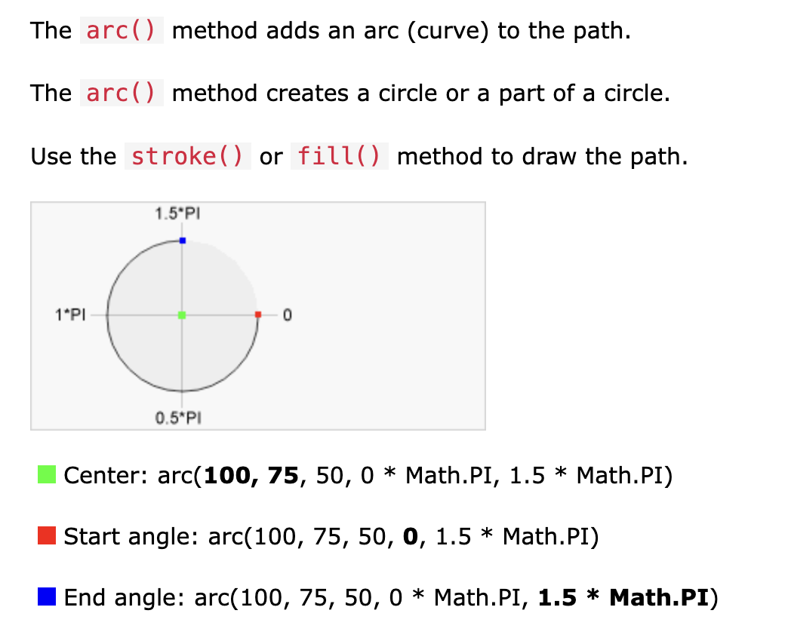

# canvas API example: Splatter

## splatter()

```javascript
function splatter(posX, posY) {
  const baseSize = 10;
  const baseSpeed = 5;
  const baseParticles = 20;

  for (let i = 0; i < baseParticles; i++) {
    const angle = Math.random() * Math.PI * 2;
    const speed = Math.random() * baseSpeed + 1;
    const size = Math.random() * baseSize + 5;
    const color = getRandomColor();

    const dx = Math.cos(angle) * speed;
    const dy = Math.sin(angle) * speed;

    const x = posX;
    const y = posY;

    particles.push({ x, y, dx, dy, size, color });
  }

  if (particles.length > 0) {
    requestAnimationFrame(update);
  }
}
```

- 처음 화면을 클릭했을 때, 호출되는 함수
- **baseSize: 물감 입자의 기본 사이즈**
- **baseSpeed: 물감이 퍼지는 기본 속도**
- **baseParticles: 물감의 기본 개수**
- **angle**
  - 물감의 각 입자가 퍼지는 각도, 즉 물감 움직임의 방향
  - Math.random()은 0에서 1 사이의 값을 반환
  - 따라서 0부터 360도 사이의 무작위 각도 값을 생성하여 물방울을 원 주위에 분포
- **dx, dy**
  - dx는 x축 방향으로의 이동량, dy는 y축 방향으로의 이동량
  - 반지름이 1인 원을 예시로 한다면, 주어진 angle에 대해 cos 값을 구하면 x축으로의 이동량을 구할 수 있음
  - 마찬가지로 주어진 angle에 대해 sin 값을 구하면 y축으로의 이동량을 구할 수 있음
  - speed를 곱하는 이유는?
    - speed는 물감 입자가 퍼지는 속도를 의미함
    - cos(), sin()는 -1에서 1 사이의 값을 반환
    - 원래의 입자 위치(x, y)에 점진적으로 dx와 dy를 더하면서 물감이 퍼져 나가는 움직임을 구현할 수 있음
    - 이때 speed를 곱하면 각 물감의 입자가 퍼지는 속도를 다르게 해줄 수 있다.

## **requestAnimationFrame()**

- 애니메이션 프레임을 요청하는 함수
- **splatter() 내부에서의 호출**
  - 화면을 클릭할 때마다 호출된다.
  - 최초의 애니메이션 프레임 시작(첫번째 애니메이션 상태 update)
- **update() 내부에서의 호출**
  - update()를 재귀적으로 호출하면서 지속적으로 애니메이션 프레임을 업데이트한다.

## update()

```javascript
function update() {
  ctx.clearRect(0, 0, canvas.width, canvas.height);

  particles.forEach((p, index) => {
    p.x += p.dx;
    p.y += p.dy;
    p.size *= 0.97; // Decrease particle size over time

    ctx.beginPath();
    ctx.arc(p.x, p.y, p.size, 0, Math.PI * 2);
    ctx.fillStyle = p.color;
    ctx.fill();

    if (p.size < 1) {
      particles.splice(index, 1); // Remove small particles
    }
  });

  if (particles.length > 0) {
    requestAnimationFrame(update);
  }
}
```

- 매 프레임 마다 호출되는 함수
- **ctx: canvas API의 현재 context(현재 2d)**
- **ctx.beginPath()**
  - CanvasRenderingContext2D.beginPath()
  - 새로운 path 경로를 canvas에 그릴 때 호출하는 함수, 그리는 경로를 초기화한다.
    - canvas에서 경로(path)는 도형을 그리거나 선을 그릴 때 사용되는 명령의 연속
    - 하지만 경로는 단순히 명령의 연속이기 때문에, 서로 다른 도형을 그릴 때마다 경로를 분리해주지 않으면 이전의 그리기 명령과 혼동될 수 있음
    - 기존의 canvas 경로를 다르게 변경하고 싶을 때는 `moveTo()` 함수 사용(= 새로 그림을 그리려는 시작 위치를 다른 곳으로 옮긴다.)
- **ctx.arc(x, y, radius, startAngle, endAngle)**
  
  출처: https://www.w3schools.com/jsref/canvas_arc.asp

  - canvas API에서 원을 그리는 함수
  - **위치 설정:** x와 y는 물방울의 중심 위치를 나타냄. 이를 통해 물방울이 화면에서 어디에 위치할지를 결정

  - **크기 설정:** radius는 물방울의 반지름을 나타냄. 이를 통해 물방울의 크기를 조절.

  - **모양 설정:** startAngle과 endAngle은 원의 호를 그릴 때 시작과 종료 각도를 나타냄.
    - 여기에서는 0부터 **Math.PI \* 2**까지로 설정하여 전체 원을 그림

- **ctx.fillStyle**
  - 물방울의 색상을 설정합니다.

## full code

```html
<!DOCTYPE html>
<html lang="en">
  <head>
    <meta charset="UTF-8" />
    <meta name="viewport" content="width=device-width, initial-scale=1.0" />
    <title>Ink Splatter Animation</title>
    <style>
      body {
        display: flex;
        justify-content: center;
        align-items: center;
        min-height: 100vh;
        margin: 0;
        background-color: #f0f0f0;
      }
      canvas {
        border: 1px solid #333;
      }
    </style>
  </head>
  <body>
    <canvas id="canvas"></canvas>
    <script>
      const canvas = document.getElementById("canvas");
      const ctx = canvas.getContext("2d");
      canvas.width = window.innerWidth;
      canvas.height = window.innerHeight;

      window.addEventListener("click", (e) => {
        splatter(e.x, e.y);
      });

      const particles = [];

      function splatter(posX, posY) {
        const baseSize = 10;
        const baseSpeed = 5;
        const baseParticles = 20;

        for (let i = 0; i < baseParticles; i++) {
          const angle = Math.random() * Math.PI * 2;
          const speed = Math.random() * baseSpeed + 1;
          const size = Math.random() * baseSize + 5;
          const color = getRandomColor();

          const dx = Math.cos(angle) * speed;
          const dy = Math.sin(angle) * speed;

          const x = posX;
          const y = posY;

          particles.push({ x, y, dx, dy, size, color });
        }

        if (particles.length > 0) {
          requestAnimationFrame(update);
        }
      }

      function update() {
        ctx.clearRect(0, 0, canvas.width, canvas.height);

        particles.forEach((p, index) => {
          p.x += p.dx;
          p.y += p.dy;
          p.size *= 0.97; // Decrease particle size over time

          ctx.beginPath();
          ctx.arc(p.x, p.y, p.size, 0, Math.PI * 2);
          ctx.fillStyle = p.color;
          ctx.fill();

          if (p.size < 1) {
            particles.splice(index, 1); // Remove small particles
          }
        });

        if (particles.length > 0) {
          requestAnimationFrame(update);
        }
      }

      function getRandomColor() {
        const letters = "0123456789ABCDEF";
        let color = "#";
        for (let i = 0; i < 6; i++) {
          color += letters[Math.floor(Math.random() * 16)];
        }
        return color;
      }
    </script>
  </body>
</html>
```
