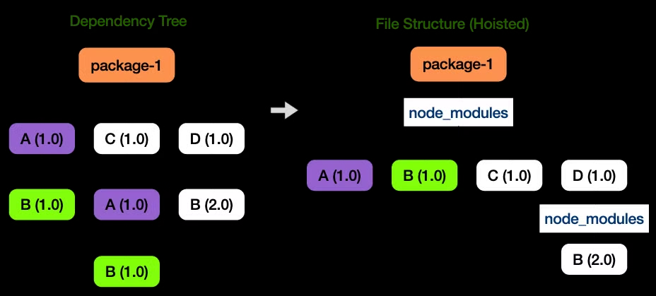

# Yarn

- facebook에서 개발한 자바스크립트 패키지 매니저
- yarn.lock 파일로 의존성 버전 관리 → 모든 프로젝트에 같은 버전의 패키지를 설치할 수 있음(npm도 `package-lock.json` 으로 관리)
- 패키지 병렬 설치 및 자동 설치로 인해 일반적으로 npm보다 더 좋은 성능을 보장 → 다만 최신 npm 버전(v5 이상)에서는 npm 성능도 많이 보완됨

# 패키지 병렬 설치

- 순차적으로 패키지를 설치하는 npm과 달리 yarn은 여러 패키지를 병렬로 설치하도록 최적화가 되어 있음

# 오프라인 패키지 설치 가능

- 패키지가 한번 설치되어 로컬 cache에 있다면, 오프라인 상태에서도 패키지 설치가 가능함

**yarn classic 기준 가이드**

1. 필요한 패키지 설치 후 `.yarnrc` 파일 생성
2. 아래 내용 작성

   ```yaml
   yarn-offline-mirror "./packages-offline-cache"
   yarn-offline-mirror-pruning true
   ```

3. `node_modules/` , `yarn.lock` 파일 삭제, `yarn cache clean` 실행
4. `yarn install` 실행
5. `./pacakges-offline-cache` 디렉토리에 node_modules가 `.tgz` 형태로 저장되어 있는 것을 확인
6. 이후에는 오프라인 환경에서 `yarn install --offline` 명령어로 패키지 설치 가능

`yarn-offline-mirror-pruning`은 업데이트 된 패키지를 추가할 때 `yarn cache`를 먼저 확인하고 `yarn cache`에 없는 `dependency`를 가져온다.
https://classic.yarnpkg.com/blog/2016/11/24/offline-mirror/

[https://velog.io/@yeoonnii/오프라인에서-React-패키지-매니저npmyarn-install하기](https://velog.io/@yeoonnii/%EC%98%A4%ED%94%84%EB%9D%BC%EC%9D%B8%EC%97%90%EC%84%9C-React-%ED%8C%A8%ED%82%A4%EC%A7%80-%EB%A7%A4%EB%8B%88%EC%A0%80npmyarn-install%ED%95%98%EA%B8%B0)

**yarn v2 부터는 .cache 폴더를 통해 캐싱된 패키지를 오프라인으로 설치 가능해짐**

# Caching

- yarn은 `enableGlobalCache` 를 false로 셋팅하여 프로젝트마다 패키지를 별도로 캐싱 가능 → `/.cache/yarn` 디렉토리에 패키지가 저장됨
- 패키지를 다운로드할 때 속도가 빠름

https://yarnpkg.com/features/caching#offline-mirror

# Hoisting

- 중복 의존성 설치를 방지하기 위한 기법



- A 패키지v1은 B 패키지v1를 의존하고 있는데, C 패키지는 A 패키지 v1를 의존함
- 패키지를 단순 설치하게 되면 A 패키지v1이 중복 설치되면서 B 패키지 v1도 중복 설치되는 이슈가 발생
- 이때 패키지 매니저는 A 패키지v1과 B 패키지v1를 호이스팅하여 한 번만 설치
- **yarn classic (yarn v1) 에서는 호이스팅에 의해 유령 의존성 문제가 발생함 → yarn v2+(yarn berry) 부터는 PnP 방식으로 이러한 문제를 해결**

## 유령 의존성이란?

- 중복 설치를 방지하기 위해 패키지를 호이스팅하면서 직접적으로 의존하지 않는 패키지를 `require()` 하여 사용할 수 있는 현상
- 만약 A 패키지가 A’ 패키지를 의존한다고 가정
  - A’ 패키지가 호이스팅에 의해 직접적으로 사용되는 이슈가 발생(유령 의존성)
  - A 패키지를 지우면 A’ 패키지도 제거되면서 A’ 패키지를 사용하던 부분에서 장애가 발생할 수 있음

**참고**
https://d2.naver.com/helloworld/7553804

https://velog.io/@dudgus1670/yarn

https://medium.com/@shunya.ekaya01/understanding-the-difference-between-npm-and-yarn-26b4cf1405f

https://velog.io/@seobbang/%ED%8C%A8%ED%82%A4%EC%A7%80-%EB%A7%A4%EB%8B%88%EC%A0%80-npm-yarn-pnpm-yarn-berry

https://medium.com/wantedjobs/yarn-classic%EC%97%90%EC%84%9C-pnpm%EC%9C%BC%EB%A1%9C-%EC%A0%84%ED%99%98%ED%95%98%EA%B8%B0-with-turborepo-7c0c37cb3f9e
