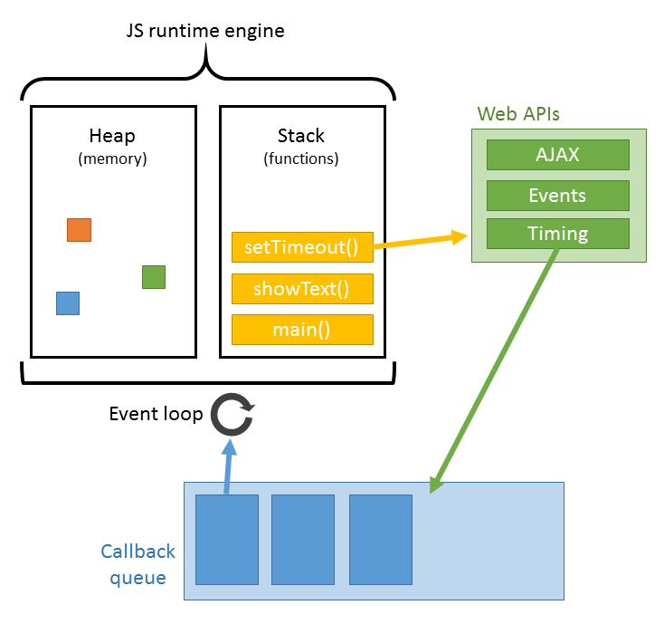
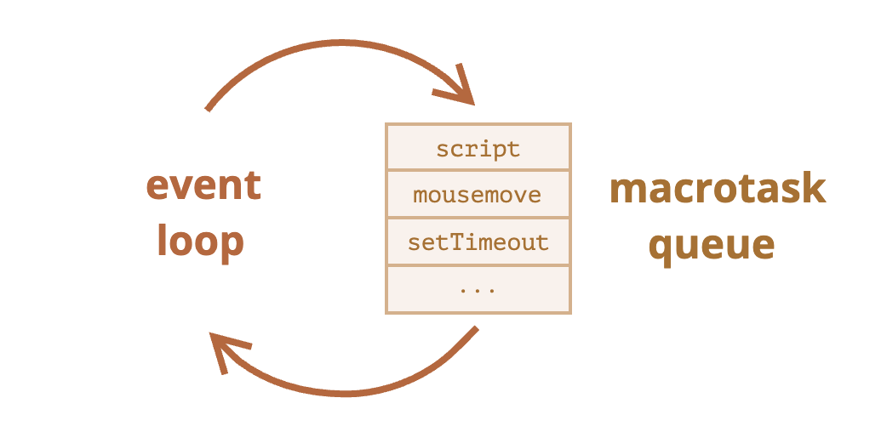

# 자바스크립트 비동기 프로그래밍 동작 원리
- 자바스크립트는 기본적으로 call stack이 하나이면서 main thread 하나로 동작하는 싱글 스레드 언어
- 테스크가 요청되면 call stack에서 pop하여 요청 작업을 순차적으로 실행
- 브라우저 상에서 비동기 요청 작업의 경우, Event loop와 Web API를 이용
  - 비동기 처리에서 소스코드의 평가와 실행을 제외한 모든 처리는 자바스크립트를 구동하는 환경인 브라우저나 Node.js가 담당
## 선결지식
- event loop
- task queue
- web API


## 동작 원리
1. js 엔진이 즉시 처리하지 못하는 테스크(Web APIs, 비동기 함수의 콜백 함수 등)는 Web API에서 별도로 처리하고
2. 브라우저(혹은 Node)가 Web API에서 처리된 작업 순서대로 Task queue(혹은 Callback queue)에 등록
3. Call stack이 비면 Event loop가 테스크 큐에서 가장 앞에 있는 작업을 Call stack에 보냄



## Event loop
-  콜 스택에 현재 실행중인 실행 컨텍스트가 있는지, 태스크 큐에 대기중인 콜백 함수가 있는지 계속해서 확인한다.
- 콜스택이 비어 있고, 태스크 큐에 대기중인 함수가 있으면 하나씩 콜 스택으로 이동시킨다.


## Task queue의 종류
- 비동기 작업으로 등록되는 작업은 task와 microtask. 그리고 animationFrame 작업으로 구분된다.
- 대부분의 브라우저에서 microtask가 다른 task보다 먼저 처리된다.
- microtask, task가 처리된 이후 requestAnimationFrame이 호출되고 이후 브라우저 랜더링 실행
### MacroTaskQueue
- setTimeout, setInterval 등의 콜백함수
  - script
  - setTimeout
  - setInterval
  - setImmediate
  - ...



### MicroTaskQueue
- Promise callback 함수 + then/catch/finally, Mutation Observer
- 다른 macrotask, rendering 작업보다 우선순위가 높음
- 가장 처음의 script 실행이 완료되면, 이후부터 micro queue에 등록된 테스크를 가장 먼저 비우기 시작


### AnimationFrameQueue
- requestAnimationFrames으로 등록된 콜백 함수들
- repaint 직전에 queue에 있던 task들을 전부 처리
- animation에 사용하여 frame drop을 최적화 

```js
console.log("script start"); // 실행 콜스택 -> pop
// MacroTaskQueue
setTimeout(function() { //
  console.log("setTimeout");
}, 1000);

// MicroTaskQueue
Promise.resolve().then(function() {
  console.log("promise1");
}).then(function() {
  console.log("promise2");
});

// AnimationFrameQueue
requestAnimationFrame(function {
    console.log("requestAnimationFrame");
})
console.log("script end");
```
1. 'script 실행 작업'이 stack에 등록된다.
2. console.log('script start')가 처리된다.
3. setTimeout 작업이 stack에 등록되고, Web API에게
setTimeout을 요청한다. 이때 setTimeout의 callback 함수를 함께 전달한다.
4. 요청 이후 stack에 있는 setTimeout 작업은 제거된다.
5. Web API는 setTimeout 작업(0초 후)이 완료되면 setTimeout callback 함수를 `task queue`에 등록한다.
6. Promise 작업이 stack에 등록되고, Web API에게 Promise 작업을 요청한다. 이때 Promise.then의 callback 함수를 함께 전달한다. 요청 이후 stack에 있는 Promise 작업은 제거된다.
7. Web API는 Promise 작업이 완료되면 Promise.then의 callback 함수를 `microtask queue`에 등록한다.
8. requestAnimation 작업이 stack에 등록되고, Web API에게 requestAnimation을 요청한다. 이때 requestAnimation의 callback 함수를 함께 전달한다. 요청 이후 stack에 있는 requestAnimation 작업은 제거된다.
9. Web API는 requestAnimation의 callback 함수를 animation frame에 등록한다.
10. console.log('script end')가 처리된다.
11. 'script 실행 작업'이 완료되어 stack에서 제거된다.
12. stack이 비워지면 먼저 microtask queue에 등록된 Promise.then 의 callback 함수를 stack에 등록한다.
13. 첫번째 Promise.then의 callback 함수가 실행되어 내부의 console.log('promise1')가 처리된다.
14. 첫번째 Promise.then 다음에 Promise.then이 있다면 다음 Promise.then의 callback 함수를 microtask queue에 등록한다.
15. stack 에서 첫번째 Promise.then의 callback 함수를 제거하고 microtask queue에서 첫번째 Promise.then의 callback 함수를 제거한다.
16. 두번째 Promise.then의 callback 함수를 stack에 등록한다.
17. 두번째 Promise.then의 callback 함수가 실행되어 내부의 console.log('promise2')가 처리된다.
18. stack 에서 두번째 Promise.then의 callback 함수를 제거한다.
19. microtask 작업이 완료되면 animation frame에 등록된 callback 함수를 꺼내 실행한다.
20. 이후 브라우저는 랜더링 작업을 하여 UI를 업데이트한다.
21. stack과 microtask queue가 비워지면 task queue에 등록된 callback 함수를 꺼내 stack에 등록한다.
22. setTimeout의 callback가 실행되어 내부의 console.log('setTimeout')이 처리된다.
23. setTimeout의 callback 함수 실행이 완료되면 stack에서 제거된다


## 참고

https://javascript.info/event-loop

https://sculove.github.io/post/javascriptflow/

https://jakearchibald.com/2015/tasks-microtasks-queues-and-schedules/
(macro queue, micro queue 실행 시뮬레이션 참고)