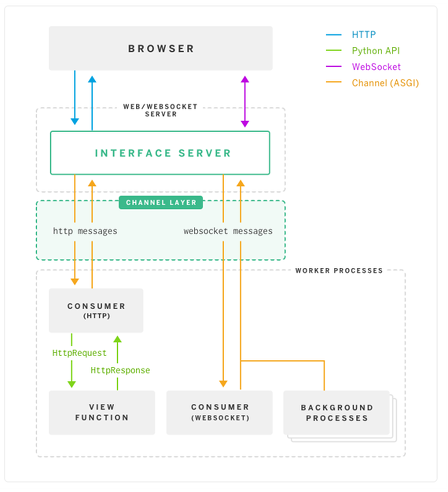
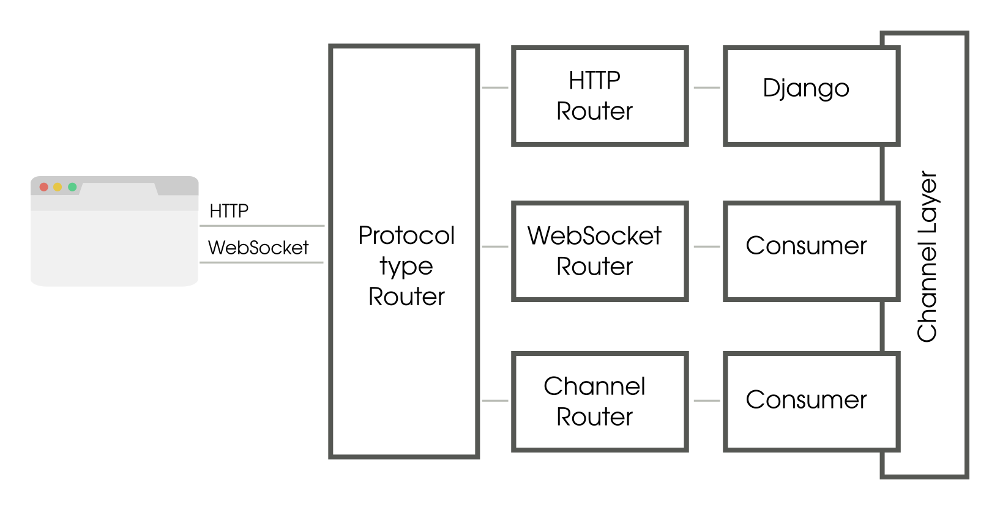

# Channels 라이브러리

> AGSI 를 통한 비동기 요청 응답 처리 가능
>
> 웹소켓, 채팅 프로토콜 등 처리 가능(그래서 이 라이브러리로 채팅방을 구현할 수 있다!)
>
> 


## 동작 원리



https://victorydntmd.tistory.com/261




https://arunrocks.com/understanding-django-channels/


----


**Django Channels** facilitates support of **WebSockets in Django in a manner similar to traditional HTTP views.** It wraps Django’s native asynchronous view support, allowing Django projects to handle not only HTTP, but also protocols that require long-running connections, such as WebSockets, MQTT, chatbots, etc.

- 2player tic-tac-toe game tutorial(django 활용!)

https://blog.logrocket.com/django-channels-and-websockets/


- **Websocket**이란?

  - ```
    The WebSocket API is an advanced technology that makes it possible to open a two-way interactive communication session between the user's browser and a server. With this API, you can send messages to a server and receive event-driven responses without having to poll the server for a reply.
    ```

    https://developer.mozilla.org/en-US/docs/Web/API/WebSockets_API

  - `WebSocket`객체는 연결을 생성하고 관리할 수 있는 API 들을 제공

    `WebSocket` 생성자는 하나의 필수 파라미터와, 하나의 옵셔널 파라미터를 받음

  ```
  WebSocket WebSocket(
    in DOMString url,
    in optional DOMString protocols
  );
  
  WebSocket WebSocket(
    in DOMString url,
    in optional DOMString[] protocols
  );
  ```

