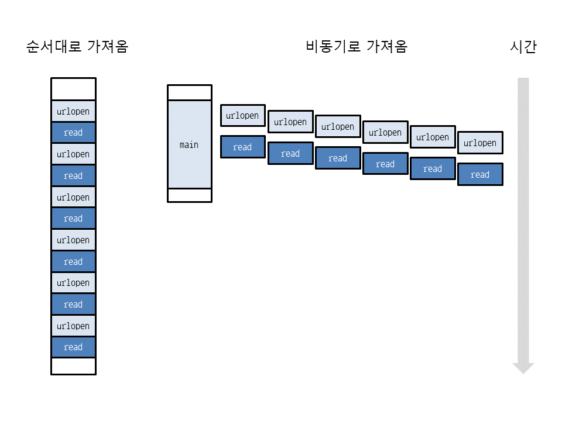

# async/await 

> asyncio 라고 함
>
> 파이썬에서 비동기 함수 호출이 가능하도록 돕는 키워드


## 코루틴

> 파이썬은 제너레이터 기반의 코루틴과 구분하기 위해 async def로 만든 코루틴을 네이티브 코루틴이라고 함
>
> 3.5 이상 파이썬 버전에서 async def 사용 가능
>
> ```
> 제너레이터 기반 코루틴
> 참고 제너레이터 기반 코루틴에 대한 지원은 폐지되었고 파이썬 3.10에서 삭제될 예정입니다.
> 제너레이터 기반 코루틴은 async/await 문법 전에 나왔습니다. 퓨처와 다른 코루틴을 기다리기 위해 yield from 표현식을 사용하는 파이썬 제너레이터입니다.
> 
> 제너레이터 기반 코루틴은 @asyncio.coroutine으로 데코레이트 되어야 하지만 강제되지는 않습니다.
> ```


```python
async def 함수이름():
    코드
```


### 이벤트 루프

```
이벤트 루프는 모든 asyncio 응용 프로그램의 핵심입니다. 이벤트 루프는 비동기 태스크 및 콜백을 실행하고 네트워크 IO 연산을 수행하며 자식 프로세스를 실행합니다.

응용 프로그램 개발자는 일반적으로 asyncio.run()과 같은 고수준의 asyncio 함수를 사용해야 하며, 루프 객체를 참조하거나 메서드를 호출할 필요가 거의 없습니다. 이 절은 주로 이벤트 루프 동작을 세부적으로 제어해야 하는 저수준 코드, 라이브러리 및 프레임워크의 작성자를 대상으로 합니다.

출처: https://docs.python.org/ko/3/library/asyncio-eventloop.html#asyncio.get_running_loop
```


```python
import asyncio
 
async def hello():    # async def로 네이티브 코루틴을 만듦
    print('Hello, world!')
 
loop = asyncio.get_event_loop()     # 이벤트 루프를 얻음
loop.run_until_complete(hello())    # hello가 끝날 때까지 기다림
loop.close()              # 이벤트 루프를 닫아줌
```

- 네이티브 코루틴을 호출하면 코루틴 객체가 생성된다.
- `get_event_loop()`
  - 이벤트 루프를 얻는 함수

- `run_until_complete(코루틴객체 또는 퓨처 객체)`
  - 네이티브 코루틴이 이벤트 루프에서 실행되도록 예약하고 해당 네이티브 코루틴이 끝날 때까지 기다린다.


## await

- `await` 키워드로 네이티브 코루틴 실행하기
- 객체가 `await` 표현식에서 사용될 수 있을 때 어웨이터블 객체라고 말함
  - 코루틴 객체
  - 테스크 객체
  - 퓨처 객체

```python
import asyncio

async def nested():
    return 42

async def main():
    # Nothing happens if we just call "nested()".
    # A coroutine object is created but not awaited,
    # so it *won't run at all*.
    nested()

    # Let's do it differently now and await it:
    print(await nested())  # will print "42".

asyncio.run(main())
```

- 그냥 네이티브 코루틴을 호출하면 코루틴 객체가 생성은 되지만 실행은 되지 않는다.
- `await` 키워드와 함께 써야 네이티브 코루틴을 실행시킬 수 있음
- 단, `await` 는 네이티브 코루틴 안에서만 사용 가능


await 키워드는 파이썬 3.5 이상부터 사용 가능, 3.4에서는 yield from을 사용

- **변수 = await 코루틴객체**
- **변수 = await 퓨처객체**
- **변수 = await 태스크객체**

```python
import asyncio
 
async def add(a, b):
    print('add: {0} + {1}'.format(a, b))
    await asyncio.sleep(1.0)    # 1초 대기. asyncio.sleep도 네이티브 코루틴
    return a + b    # 두 수를 더한 결과 반환
 
async def print_add(a, b):
    result = await add(a, b)    # await로 다른 네이티브 코루틴 실행하고 반환값을 변수에 저장
    print('print_add: {0} + {1} = {2}'.format(a, b, result))
 
loop = asyncio.get_event_loop()             # 이벤트 루프를 얻음
loop.run_until_complete(print_add(1, 2))    # print_add가 끝날 때까지 이벤트 루프를 실행
loop.close()                                # 이벤트 루프를 닫음
```


**결과**

- add: 1 + 2가 출력되고 1초 뒤에 print_add: 1 + 2 = 3이 출력

```
add: 1 + 2
print_add: 1 + 2 = 3
```


### 퓨처와 테스크

```
퓨처와 태스크
퓨처(asyncio.Future)는 미래에 할 일을 표현하는 클래스인데 할 일을 취소하거나 상태 확인, 완료 및 결과 설정에 사용합니다.

태스크(asyncio.Task)는 asyncio.Future의 파생 클래스이며 asyncio.Future의 기능과 실행할 코루틴의 객체를 포함하고 있습니다. 태스크는 코루틴의 실행을 취소하거나 상태 확인, 완료 및 결과 설정에 사용합니다. 이 부분은 내용이 다소 복잡하므로 이정도까지만 설명하겠습니다.

https://dojang.io/mod/page/view.php?id=2469
```

- 테스크는 코루틴을 동시에 예약하는 데 사용된다.

- `asyncio.create_task()` 와 같은 함수 사용하여 테스크로 싸일 때 코루틴은 곧 실행되도록 자동 예약

  ```python
  mport asyncio
  
  async def nested():
      return 42
  
  async def main():
      # Schedule nested() to run soon concurrently
      # with "main()".
      task = asyncio.create_task(nested())
  
      # "task" can now be used to cancel "nested()", or
      # can simply be awaited to wait until it is complete:
      await task
  
  asyncio.run(main())
  ```

  - create_task(코루틴 객체) : 코루틴 객체 테스크 예약
  - 이후 await task로 예약한 코루틴 객체를 실행
  - await 이외에 코루틴 실행 취소도 가능


## 웹페이지를 비동기로 가져오기

```python
from time import time
from urllib.request import Request, urlopen
import asyncio
 
urls = ['https://www.google.co.kr/search?q=' + i
        for i in ['apple', 'pear', 'grape', 'pineapple', 'orange', 'strawberry']]
 
async def fetch(url):
    request = Request(url, headers={'User-Agent': 'Mozilla/5.0'})    # UA가 없으면 403 에러 발생
    response = await loop.run_in_executor(None, urlopen, request)    # run_in_executor 사용
    page = await loop.run_in_executor(None, response.read)           # run in executor 사용
    return len(page)
 
async def main():
    futures = [asyncio.ensure_future(fetch(url)) for url in urls]
                                                           # 태스크(퓨처) 객체를 리스트로 만듦
    result = await asyncio.gather(*futures)                # 결과를 한꺼번에 가져옴
    print(result)
 
begin = time()
loop = asyncio.get_event_loop()          # 이벤트 루프를 얻음
loop.run_until_complete(main())          # main이 끝날 때까지 기다림
loop.close()                             # 이벤트 루프를 닫음
end = time()
print('실행 시간: {0:.3f}초'.format(end - begin))
```

- `urlopen` 이나 `response.read` 같은 함수는 결과가 나올 때까지 코드 실행이 중단되는데 이런 함수들을 블로킹 I/O 함수라고 부름
  - 네이티브 코루틴 안에서 블로킹 I/O 함수를 실행하려면 이벤트 루프의 `run_in_executor` 함수를 사용하여 다른 스레드(실행기)에서 병렬로 실행시켜야 함

- `run_in_executor(executor, 함수, 인수1, 인수2, 인수3 ...)`

  - 첫번째 인수 executor : 함수를 실행시켜줄 스레드 폴 또는 프로세스 풀
    - None을 넣으면 기본 스레드 풀 사용
  - 두번째 인수에 실행할 함수를 넣고, 세번째 인수부터 실행할 함수에 들어갈 인수를 차레대로 넣어준다.
  - `asyncio.Future` 객체 반환
  - 이 함수 역시 코루틴이므로 await로 실행가능

- `asyncio.ensure_future `

  - `테스크객체 = asyncio.ensure_future(코루틴 객체 또는 퓨처객체)`
  - 코루틴 객체 또는 퓨처 객체를 테스크 객체로 생성

- `asyncio.gather(코루틴객체1, 코루틴객체2 ...)`

  - `변수 = await asyncio.gather(코루틴객체1, 코루틴객체2 ...)`

  - 모든 코루틴 객체(퓨처, 테스크 객체)가 끝날 때까지 기다린 뒤 결과(반환값)을 리스트로 반환
  - 리스트가 아닌 위치인수로 코루틴 객체들을 받으므로 테스크 객체를 리스트로 만들었다면 `asyncio.gather(*futures)` 와 같이 리스트를 언패킹해서 넣어준다.
  - `asyncio.gather` 도 코루틴이므로 `await` 로 실행하여 결과를 가져옴
  - 참고로 asyncio.gather에 퓨처 객체를 넣은 순서와 결과 리스트에서 요소의 순서는 일치하지 않을 수도 있다.


- 웹 페이지를 순서대로 가져올 때와 비동기로 가져올 때 성능 비교



### run_in_executor에 키워드 인수를 사용하는 함수 넣기

```
참고 | run_in_executor에 키워드 인수를 사용하는 함수 넣기
run_in_executor 같은 함수는 위치 인수만 넣을 수 있는데 파이썬에서는 키워드 인수를 많이 사용합니다. run_in_executor에 키워드 인수를 사용하는 함수를 넣을 때는 functools.partial을 사용해야 합니다. functools.partial은 이름 그대로 부분 함수를 만들어주는 기능입니다.

```

**functools.partial(**함수, 위치인수, 키워드인수)

```python
import functools
 
async def hello(executor):
    await loop.run_in_executor(None, functools.partial(print, 'Hello', 'Python', end=' '))
```


```
functools.partial은 인수가 포함된 부분 함수를 반환하는데, 반환된 함수에 다시 인수를 지정해서 호출할 수 있습니다.
```

```python
>>> import functools
>>> hello = functools.partial(print, 'Hello', 'Python', end=' ')    # 'Hello', 'Python' end=' '이 
>>> hello()                                                         # 포함된 함수 생성
Hello Python 
>>> hello('Script', sep='-')    # 부분 함수에 다시 'Script'와 sep='-'를 넣어서 호출
Hello-Python-Script
```


----


**참고**

https://dojang.io/mod/page/view.php?id=2469

https://docs.python.org/ko/3/library/asyncio-task.html#asyncio.run

