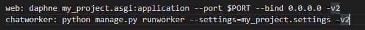
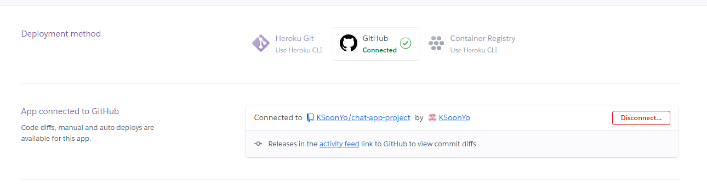
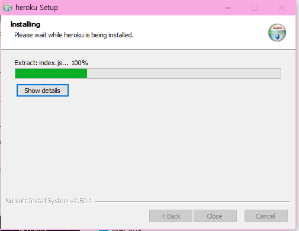
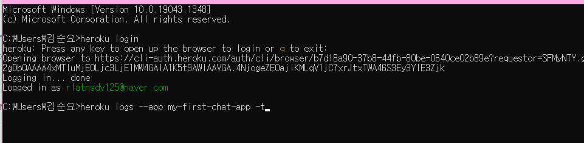
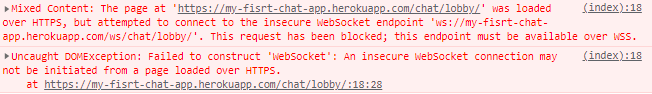
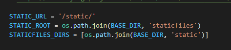
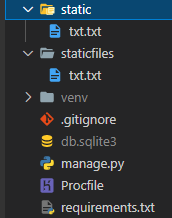

# deploy with heroku

- 채팅앱 heroku 배포 가이드 유튜브 링크

https://www.youtube.com/watch?v=zizzeE4Obc0&list=PLuqDrOrZmk5w4jh9WTORLxFWTi6q09ohW&index=40

- `Procfile` 작성(configure)

  

  my_project 부분에는 django project 폴더 이름을 기입


- github 연동

  

- requirements.txt 생성(`pip freeze > requirements.txt`)


- heroku cli 설치




- heroku cli login & log -t



- github에 push 후 deploy

  - deploy branch 클릭

  


- error issus "No web process running", code=H14

  - heroku 배포 상 이슈

  - gunicon 또는 daphne 를 `procfile`에서 configure을 제대로 하지 않으면 발생

  - 만약 제대로 configure해줬는데도 아래와 같은 오류가 뜬다면

    => configure 변경사항을 반영하고 배포를 하기 전에 `heroku ps: scale web=1,` 명령어 실행 후 배포


- Daphne에서 https 통신 시, 웹소캣 생성할 때 wss 프로토콜로 통신을 해야 한다.(기본이 http 통신이기 때문)

wss 통신을 위한 별도의 설정을 더 하지 않을 거라면 그냥 주소창에 https를 http로 바꿔서 하면 된다.


## 주요 이슈

### deploy building 중에 `twisted-iocpsupport` 패키지를 heroku가 설치하지 못하는 현상

```bash
Receiving error:

 Building wheel for twisted-iocpsupport (PEP 517): started
  ERROR: Command errored out with exit status 1:
   command: /usr/bin/python3 /tmp/tmpv8s6qz76 build_wheel /tmp/tmp9l8hgcva
       cwd: /tmp/pip-install-qsr4j4x_/twisted-iocpsupport
  Complete output (13 lines):
  running bdist_wheel
  running build
  running build_ext
  building 'twisted_iocpsupport.iocpsupport' extension
  creating build
  creating build/temp.linux-x86_64-3.8
  creating build/temp.linux-x86_64-3.8/twisted_iocpsupport
  x86_64-linux-gnu-gcc -pthread -Wno-unused-result -Wsign-compare -DNDEBUG -g -fwrapv -O2 -Wall -g -fstack-protector-strong -Wformat -Werror=format-security -g -fwrapv -O2 -g -fstack-protector-strong -Wformat -Werror=format-security -Wdate-time -D_FORTIFY_SOURCE=2 -fPIC -Itwisted_iocpsupport -I/usr/include/pyth
on3.8 -c twisted_iocpsupport/iocpsupport.c -o build/temp.linux-x86_64-3.8/twisted_iocpsupport/iocpsupport.o
  twisted_iocpsupport/iocpsupport.c:631:10: fatal error: io.h: No such file or directory
    631 | #include "io.h"
        |          ^~~~~~
  compilation terminated.
  error: command 'x86_64-linux-gnu-gcc' failed with exit status 1
  ----------------------------------------
  ERROR: Failed building wheel for twisted-iocpsupport
  Building wheel for twisted-iocpsupport (PEP 517): finished with status 'error'

```

https://stackoverflow.com/questions/66428469/twisted-iocpsupport-error-when-using-pip-on-ubuntu-debian-io-h-missing

- 정리하자면 `twisted-iocpsupport` 는 윈도우 전용 API(`I/O Completion Ports`)를 위한 패키지. Heroku 서버 상 운영체제(리눅스 계열)와 맞지 않아서 발생하는 오류다. 
- 해결방법은 배포 전에 `twisted-iocpsupport` 패키지를 uninstall하고 requirements.txt 를 갱신하면 된다!(그러나 윈도우 운영체제에서 다른 패키지를 pip install하면 `twisted-iocpsupport` 패키지가 또 자동 생성된다.) 배포 전에 신경을 쓰자!
- `Twisted` 패키지가 부모 패키지로 보이지만, 문제 생길까봐 지우지는 않았다.


### 배포하는 django 프로젝트 폴더에 staticfiles, static 경로 설정이 없는 경우

- 없으면 heroku가 배포를 안시켜준다. 만들어주자

- 또한 설정한 경로에 `staticfiles`과 `static` 폴더가 있어야 한다!

- 내용물은 빈 txt파일도 ok

  - `my_project/settings.py`

  



### heroku with gunicon VS heroku with Daphne

- gunicon는 wsgi 인터페이스라 asgi로 못 받는다.(비동기 처리를 못함)
- 즉 http는 받을 수 있을진 몰라도  비동기적으로 오는 ws 요청은 받지 못한다.
- 채팅앱은 http 요청 시 정적 파일을 제공하고, ws 요청 시 채팅 통신이 이루어져야 하므로, http 프로토콜과 ws 프로토콜을 모두 수용 가능한 `Daphne` 를 쓰면 해결!

- procfile에서 Daphne configure


### heroku cli에서 --app 뒤에 앱 이름을 잘 썼는데 `you do not have access the app`이 나오는 경우

- heroku 배포 시 생성한 앱 이름을 적는 게 아니라 heroku 원격 저장소에 등록한 app이름을 대야 한다.(heroku 사이트의 settings 탭에 앱 이름이 적혀있다. 오타 조심!)


