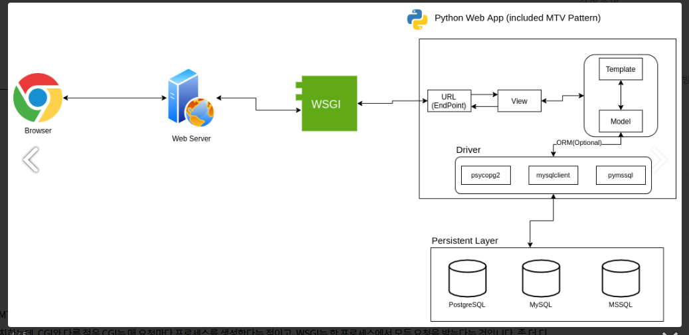
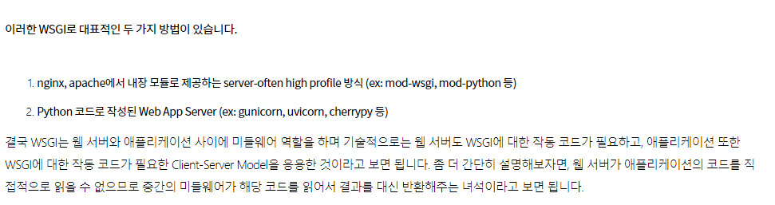
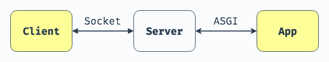
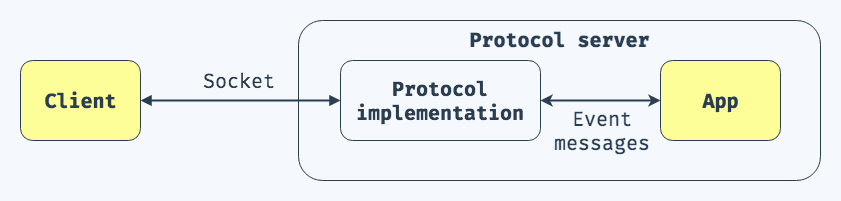
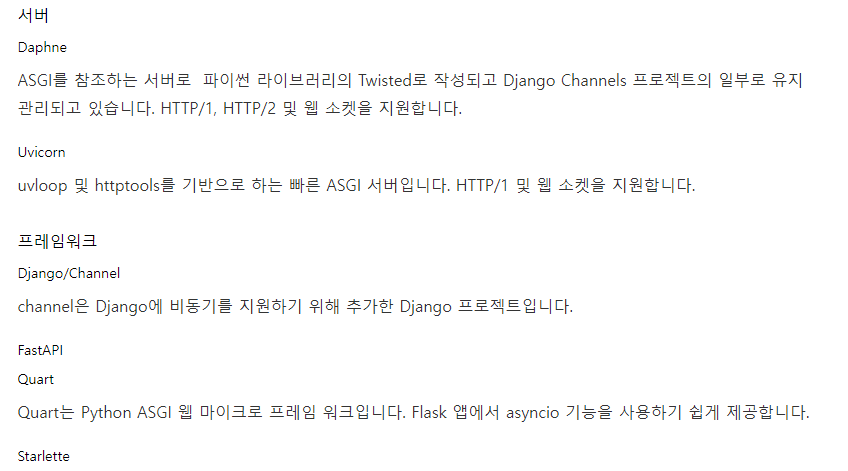

# ASGI, WSGI

> 파이썬 웹 서버 게이트웨이 인터페이스
>
> 파이썬으로 작성한 앱이 웹서버와 통신을 할 때 웹서버 - 어플리케이션 사이에서 서로 통신이 이루어지도록 돕는 게이트웨이 인터페이스


## WSGI(Web Server Gateway Interface)

> WSGI는 [서버](https://ko.wikipedia.org/wiki/서버)와 [게이트웨이](https://ko.wikipedia.org/wiki/게이트웨이) , [애플리케이션](https://ko.wikipedia.org/wiki/애플리케이션)과 [프레임워크](https://ko.wikipedia.org/wiki/프레임워크) 양단으로 나눠져있다. WSGI 리퀘스트를 처리하려면, 서버단에서 환경정보와 콜백함수를 애플리케이션단에 제공해야한다. 애플리케이션은 그 요청을 처리하고 미리 제공된 콜백함수를 통해 서버단에 응답한다. WSGI 미들웨어(라고 불린다.)가 WSGI 서버와 애플리케이션 사이를 보충해주는데, **이 미들웨어는 서버의 관점에서는 애플리케이션으로, 애플리케이션의 관점에서는 서버로 행동한다.** 이 미들웨어는 다음과 같은 기능을 가진다.
>
> - 환경변수가 바뀌면 타겟 URL에 따라서 리퀘스트의 경로를 지정해준다.
> - 같은 프로세스에서 여러 애플리케이션과 프레임워크가 실행되게 한다.
> - XSLT 스타일시트를 적용하는 것과 같이 전처리를 한다.
>
> by 위키백과

### 애플리케이션 예시

```
def application(environ, start_response):
    start_response('200 OK', [('Content-Type', 'text/plain')])
    yield 'Hello World\n'
```

- 1번째 줄에서는 `environ`와 `start_response`를 매개변수를 가지는 callable을 선언하는데, `environ`은 환경변수를 가지고 있는 딕셔너리이고 `start_response`는 `status`와 `response_headers`를 가지는 callable이다.
- 2번째 줄에서는 `start_response`를 호출한다.
- 3번째 줄에서는 문자열을 리턴한다.

### 애플리케이션 호출 예시

애플리케이션을 호출하고 리스폰스를 받는 예시이다

```
def call_application(app, environ):
    body = []
    status_headers = [None, None]
    def start_response(status, headers):
        status_headers[:] = [status, headers]
        return body.append(status_headers)
    app_iter = app(environ, start_response)
    try:
        for item in app_iter:
            body.append(item)
    finally:
        if hasattr(app_iter, 'close'):
            app_iter.close()
    return status_headers[0], status_headers[1], ''.join(body)

status, headers, body = call_application(app, {...environ...})
```






https://blog.neonkid.xyz/249


### ASGI 공식문서

WSGI applications are a single, synchronous callable that takes a request and returns a response; this doesn’t allow for long-lived connections, like you get with long-poll HTTP or WebSocket connections.

Even if we made this callable asynchronous, it still only has a single path to provide a request, so protocols that have multiple incoming events (like receiving WebSocket frames) can’t trigger this.

=> 동기적으로 요청을 처리하여 response하기 때문에 여러 요청이 들어올 경우, 긴 연결을 허용하지 않는 WSGI 특성 상 대처하기가 어려움.(5개 요청 중에 2개는 응답을 못 받을 수 있음)

=> **대안**: ASGI


## ASGI

> 기본적으로 요청을 비동기로 처리하지만, 동기적으로도 처리가 가능!
>
> WSGI의 superset으로 설계가 되어있음(따라서 WSGI 어플리케이션으로 통신하는 두 극단은 ASGI 서버로도 특정 라이브러리를 통해 동작 가능)
>
> 비동기 처리 시 async/await 키워드 사용
>
> 대표 ASGI Web App: Unicon





**more detailed**




**ASGI 기본 구성**

```python
async def app(scope, receive, send):
    ...
'''
Let's take a look at the 3 arguments:

scope is a dictionary that contains information about the incoming request. Its contents vary between HTTP and WebSocket connections.

receive is an asynchronous function used to receive ASGI event messages.

send is an asynchronous function used to send ASGI event messages.
'''
```


ASGI is structured as **a single, asynchronous callable**. 

-> callable? : 호출 가능한 것들(`변수`는 호출 불가, `함수` 호출 가능)

함수를 ()로 호출 가능하면 해당 함수는 callble 객체이다.

기본적으로 함수가 파이썬의 callable 객체가 되려면 `__call__` 이 정의가 되어 있어야 하는데, 

```python
def foo():
    pass
```

이렇게 정의한 함수면 다 callable!(`__call__` 이 정의가 되어있음)

```
User defined functions (function type, like foo) have __call__.

Built-in functions (e.g max) also have __call__, see callable(max).

Methods of built-in objects, yes: callable(str.isupper).

Class objects, yes (type defines a __call__ for them):
```

by https://stackoverflow.com/questions/46263435/what-is-the-definition-of-a-callable-type

=> 즉,  callble인자는 callback 함수로 봐도 무방

----


It takes a `scope`, which is a `dict` **containing details about the specific connection**, `send`, **an asynchronous callable, that lets the application send event messages to the client**, and `receive`, **an asynchronous callable which lets the application receive event messages from the client.**

https://asgi.readthedocs.io/en/latest/introduction.html

- scope: 특정 연결에 대해 세부정보들을 담고있는 딕셔너리 타입의 인자
- send : 어플리케이션이 이벤트 메세지들을 클라이언트에게 보내주는 비동기적 callable 인자
- receive: 어플리케이션이 이벤트 메시지들을 클라이언트로부터 받는 비동기적 callable 인자


Every *event* that you send or receive is a Python `dict`, with a predefined format. **It’s these event formats that form the basis of the standard, and allow applications to be swappable between servers.**

=> `even`t는 dictionary 타입으로 정의가 된다!

These *events* each have a defined `type` key, which can be used to infer the event’s structure. Here’s an example event that you might receive from `receive` with the body from a HTTP request:

- receive로 이벤트를 받을 때

```
{
    "type": "http.request",
    "body": b"Hello World",
    "more_body": False,
}
```


And here’s an example of an event you might pass to `send` to send an outgoing WebSocket message:

- send로 이벤트를 보낼 때

```
{
    "type": "websocket.send",
    "text": "Hello world!",
}
```


**ASGI의 대표적인 예시들**



https://brownbears.tistory.com/505

=> Channels 라이브러리도 ASGI 서버를 내장하고 있음!

---

