# **React 기초 노트**

version

- react: 18.0.0


## 목차
[create-react-app](#create-react-app)

[component](#component)

[Style](#style)
	[style 직접 지정](#style-직접-지정)
	[css 파일 import](#css-파일-import)

[props](#props)

[state](#state)
	[기본 state 변경](#기본-state-변경)
	[Array(Object) state 변경](#array(object)-state-변경)

[hooks](##hooks)
	[React 생애 주기](#eeact-생애주기)
	[useEffect](#useeffect)

[전체코드](#전체코드)

[References](#References)


# **create-react-app**

> 조건
>
> - **node js가 설치되어 있어야 함**

```bash
npx create-react-app <app name>
//
cd <app name>
//
npm start
```

1. <app name> react 프로젝트 생성
   - <app name> 안에 원하는 이름을 기입
2. 앱으로 이동
3. 서버 시작

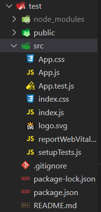


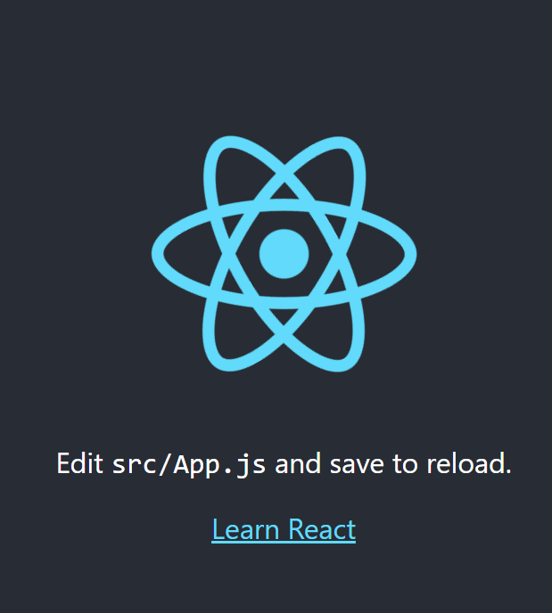


# **component**

> React에서는 JSX(JavaScript + XML) 라는 특수한 문법으로 렌더링할 컴포넌트를 독립적으로 관리할 수 있다.

1. 함수형

```jsx
// src/Component.js
import React from 'react'

const ComponentName = () => {
    return (
        <div className="class">
            <h1> 컴포넌트! </h1>
        </div>
    )
}

export default ComponentName
```

- src 폴더에 `ComponentName.js` 파일 생성

  - ComponentName 은 본인이 원하는 이름으로 변경해서 작성 가능

- 컴포넌트 이름은 대문자로 시작(관례)

- 함수로 선언하고 return 문 괄호 안에 JSX 문법을 사용하여 렌더링할 HTML 요소 작성(JSX의 작성 방법은 HTML과 비슷하지만 약간 다른 부분도 있음.)

  - JS 문법 상 함수 선언하는 모든 방법 통용

    - 예를 들어 위 코드와 아래 코드의 의미는 동일하다.

    ```jsx
    function ComponentName(){
        return (
            ...
            ...
        )
    }
    ```

  - TMI) return 문 내부의 태그를 실행하는 시점에서 return문의 동작은 아래 코드와 동일하다.

    ```jsx
    return React.createElement('div', {className: 'class'}),
        React.createElement('h1', null, '컴포넌트1')
    ```

- ComponentName을 함수형으로 선언했으므로 자바스크립트 함수처럼 export 가능

- 선언한 컴포넌트가 렌더링할 위치에 해당 컴포넌트를 삽입

  - 기존 App.js 파일 내부에 작성된 것을 모두 지우고 아래 코드 작성

  ```jsx
  // src/App.js
  import ComponentName from './ComponentName.js'
  
  function App() {
    return (
      <div className="App">
            <ComponentName></ComponentName>
      </div>
    )
  }
  
  export default App
  ```

  - 물론 App.js 에서 컴포넌트를 선언해서 바로 사용하는 것도 가능하다.

    ```jsx
    import React from 'react'
    
    const ComponentName = () => {
        return (
            <div className="class">
                <h1> 컴포넌트! </h1>
            </div>
        )
    }
    
    function App() {
      return (
        <div className="App">
              <ComponentName></ComponentName>
        </div>
      )
    }
    
    export default App
    ```

- **결과화면**


2. 클래스형

- React 공식 자습서 문서에서는 컴포넌트 클래스로 컴포넌트를 설명하고 있다.

  - https://ko.reactjs.org/tutorial/tutorial.html
  - 그러나 useEffect 훅 기능이 최신 React에 추가되면서 클래스형 컴포넌트를 사용하는 의미가 점차 없어지고 있다.
    - useEffect 훅에 대한 내용은 뒤에서 다룬다.

- 자습서 방식대로 함수형으로 선언된 컴포넌트를 클래스 컴포넌트로 변환하면 아래와 같다.

  ```jsx
  import React from "react"
  
  class ComponentName extends React.Component {
    render() {
      return (
        <div className="class">
          <h1> 컴포넌트!! </h1>
        </div>
      )
    }
  }
  
  class App extends React.Component {
    render() {
      return (
        <div className="App">
          <ComponentName></ComponentName>
        </div>
      )
    }
  }
  
  export default App
  ```

  - 달라진 것은 함수형으로 선언한 부분을 **React.Component를 상속한 class로 선언**해주고, return문을 `render()` 함수 내에서 처리해준다는 것 뿐이다.
  - 실행 결과 화면은 동일

# **Style**

## **style 직접 지정**

- ComponentName의 style을 아래와 같이 선언해서 스타일을 지정해줄 수 있다.

  ```jsx
  import React from "react"
  
  const ComponentName = () => {
    return (
      <div className="class" style={{ backgroundColor: "red" }}>
        <h1 style={{ color: "white" }}> 컴포넌트! </h1>
      </div>
    )
  }
  
  export default ComponentName
  ```

  - 태그 안에서 

    ```
    style={}
    ```

     로 열고 css 스타일을 지정한 Object 객체를 넣어준다.

    - JSX 상에서 스타일 속성은 **카멜케이스(camelCase)**로 표기한다.

    - 객체이므로 아래와 같이 작성도 가능하다.

      ```jsx
      import React from "react"
      
      const ComponentName = () => {
        return (
          <div className="class" style={h1Style}>
            <h1 style={divStyle}> 컴포넌트! </h1>
          </div>
        )
      }
      
      const divStyle = {
          backgroundColor: 'red'
      }
      
      const h1Style = {
          color: 'white'
      }
      
      export default ComponentName
      ```

    - 작성 순서는 상관없다.

    - 일반적으로 JSX 용법상 {} 중괄호 안에 필요에 따라 데이터를 자유롭게 넣어줄 수 있다.

      - 예를 들어 `h1` 태그 내부의 내용을 아래처럼 변경하는 것도 가능하다.

        ```jsx
        import React from "react"
        
        const ComponentName = () => {
          return (
            <div className="class">
              <h1> {content} </h1>
            </div>
          )
        }
        
        const content = "컴포넌트!(content 변수)"
        
        export default ComponentName
        ```

        

- **결과화면**

  - 전체코드

    ```jsx
    import React from "react"
    
    const ComponentName = () => {
      return (
        <div className="class" style={h1Style}>
          <h1 style={divStyle}> {content} </h1>
        </div>
      )
    }
    
    const content = "컴포넌트!(content 변수)"
    
    const divStyle = {
      backgroundColor: "red",
    }
    
    const h1Style = {
      color: "white",
    }
    
    export default ComponentName
    ```

    

## **css 파일 import**

- `ComponentName.css` 를 생성하여 import 하는 방식으로도 스타일링이 가능하다.

  - src 폴더 내부에서`ComponentName.css` 파일 생성

  - css 작성 방식 대로 스타일 지정

    ```css
    .class {
      background-color: red;
    }
    
    .title {
      color: white;
    }
    ```

    - class 라는 이름의 클래스와 title이라는 이름의 클래스에 각각의 스타일을 적용

- `ComponentName.js` 에서 css 파일을 import

  ```jsx
  import React from "react"
  import "./ComponentName.css"
  
  const ComponentName = () => {
    return (
      <div className="class">
        <h1 className="title">{content}</h1>
      </div>
    )
  }
  
  const content = "컴포넌트!(content 변수)"
  
  export default ComponentName
  ```

  - 이때 각 태그에는 class 이름이 부여되어 있어야 하는데**, JSX용법 상 태그에 `class=''`로 클래스 이름을 부여할 수 없다.(자바스크립트의 class와 이름이 겹친다.)**

  - 대신 `className=''`으로 태그에 클래스 지정 가능

    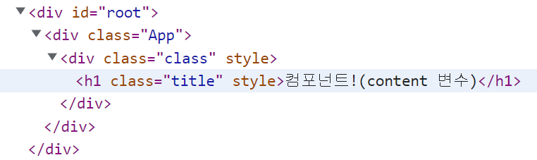

    - class 이름이 잘 들어가 있는 것을 확인할 수 있다.

- 결과 화면은 태그 내에서 style을 직접 지정한 방식과 동일하다.

  

# **props**

> props로 부모 컴포넌트에서 자식 컴포넌트로 변수값과 함수를 전달할 수 있다.

1. 변수값 전달하기
   - `props 이름 = {변수}` 형식으로 전달한다.
   - props 이름은 본인 마음대로 지어도 되지만, 가능한 전달할 변수 이름과 동일하게 짓는 것이 좋다.

```jsx
// App.js
import ComponentName from "./ComponentName.js";

function App() {
  ////////////////////////
  const value = 'example'
  const value2 = 'example2'
  ////////////////////////

  return (
    <div className="App">
      <ComponentName value={value} value2={value2} ></ComponentName>
    </div>
  );
}

export default App;
// ComponentName.js

import React from "react"
import "./ComponentName.css"

// 방법 1
const ComponentName = (props) => {
  return (
    <div className="class">
      <h1 className="title">{content}</h1>
      <h2> {props.value} </h2>
    </div>
  )
}

const content = "컴포넌트!(content 변수)"

export default ComponentName

// 방법 2
const ComponentName = ({value}) => {
  return (
    <div className="class">
      <h1 className="title">{content}</h1>
      <h2> {value} </h2>
    </div>
  )
}

const content = "컴포넌트!(content 변수)"

export default ComponentName
```

- 하위 컴포넌트에서 props를 받는 방법

  1. props 객체에 `.`으로 데이터 접근

     - 상위 컴포넌트에서 전달한 모든 변수는 props 객체로 담겨서 자식 컴포넌트로 전달된다.
     
  2. props 객체이므로 {} 구조 할당으로 값을 받아오는 것 또한 가능하다.

**결과)**


1. 함수 전달하기
   - 상위 컴포넌트에서 함수를 정의하고, 이를 하위 컴포넌트에서 실행시키는 것도 가능하다.
   - 단, **()로 실행하지 않고 함수 이름만 전달해줘야 한다.**

```jsx
// App.js
import ComponentName from "./ComponentName.js"

function App() {
  const value = "example"

  ///////////////////////////// click event handler 정의
  const handleClick = () => {
    alert("클릭!")
  }
  ////////////////////////////

  return (
    <div className="App">
      <ComponentName value={value} handleClick={handleClick}></ComponentName>
    </div>
  )
}

export default App
// ComponentName.js

import React from "react"
import "./ComponentName.css"

const ComponentName = (props) => {
  return (
      ///////////////////// props로 전달받은 click event handler(handleClick)를 onClick 콜백 함수 인자로 전달
    <div className="class" onClick={props.handleClick}>
      /////////////////////
      <h1 className="title">{content}</h1>
      <h2> {props.value} </h2>
    </div>
  )
}

const content = "컴포넌트!(content 변수)"

export default ComponentName
```

- onClick?
  - React의 JSX 상에서 특정 태그에 클릭 이벤트를 걸어줄 때 onClick이라는 이름을 사용한다.
  - onClick으로 콜백 함수를 전달할 때에도 () 를 빼고 함수 이름만 전달해줘야 한다.
  - ()를 붙인 채 전달하면 클릭 여부와 상관 없이 렌더링 되자마자 함수가 곧바로 실행되어버리므로 주의!

**결과)**

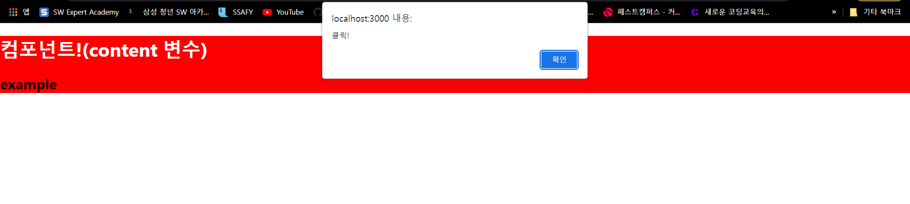

# **state**

> useState로 SPA 상에서 자주 변경되는 데이터를 관리할 수 있으며 props로 전달 또한 가능하다.

## **기본 state 변경**

- 기본적으로 컴포넌트 내부에서 선언되고 초기값이 할당된 데이터는 한번 렌더링 되고 나서는 이후에 변경이 되어도 화면 상에 반영되지 않는다.

**ComonentName.js에서 일반적인 데이터 선언**

```jsx
import React from "react"
// import "./ComponentName.css"

/////////////////////////////////////  changeValue 변수 선언
const ComponentName = (props) => {
  let changeValue = 30

  const handleValue = () => {
    changeValue += 1
  }
/////////////////////////////////////
  
  return (
    <div className="class">
      <h1 className="title">{content}</h1>
      <h2> {props.value} </h2>

	//////////////////////////////////////////// 값을 변경시키는 button 태그와 값을 표기해주는 h3 태그
      <button onClick={handleValue}> +1 </button>
      <h3> result: {changeValue}</h3>
	////////////////////////////////////////////
    </div>
  )
}

const content = "컴포넌트!(content 변수)"

export default ComponentName
```


- 한번 값이 30으로 업데이트가 되고 render가 이미 된 상태이기 때문에 아무리 버튼을 눌러도 이미 render된 result 값은 변경되지 않는다.

**useState를 사용할 경우**

```jsx
//////////////////////////////////////// useState import
import React, { useState } from "react"
////////////////////////////////////////

const ComponentName = (props) => {
  ///////////////////////////////////////////// state 선언
  const [changeValue, setChangeValue] = useState(30)
  /////////////////////////////////////////////

  const handleValue = () => {
    // changeValue += 1

    ///////////////////////////////// set 함수로 state 변수 값 변경
    let temp = changeValue
    setChangeValue(temp + 1)
    /////////////////////////////////
  }

  return (
    <div className="class">
      <h1 className="title">{content}</h1>
      <h2> {props.value} </h2>
      <button onClick={handleValue}> +1 </button>
      <h3> result: {changeValue}</h3>
    </div>
  )
}

const content = "컴포넌트!(content 변수)"

export default ComponentName
```

- `useState()`를 호출하면 배열이 반환 된다.

  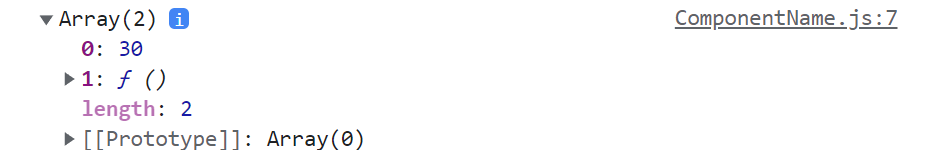

  - 배열의 0번째 값은 useState() 의 () 안에서 선언한 초기값이고, 1번째 값은 0번째에 설정한 값을 업데이트할 수 있는 함수

  - 그래서 useState의 반환값을 받기 위해 보통은 배열로 각각의 값들을 받는다.

    ```jsx
      const [changeValue, setChangeValue] = useState(30)
    ```

    - `changeValue` 에는 30이라는 초기값이 들어가고, `setChangeValue`에는 함수가 들어간다.

  - 물론 아래와 같이 함수는 받지 않고 초기 값만 받을 수도 있다.

    ```jsx
    const [changeValue] = useState(30)
    ```

  - 또한 `setChangeValue`의 경우, 이름을 마음대로 지어줄 수 있다. 보통은 state 변수 값에 set을 붙인다.

    ```jsx
    // 아래도 ok!
    const [changeValue, changeChangeValue] = useState(30)
    
    changeChangeValue(3)
    console.log(changeValue) // 3 출력
    ```

- state 값이 변경되면 컴포넌트가 전부 재렌더링 되면서 변경된 값이 화면에 출력된다.

  - **결과**

    

- **주의점**

  - state의 값을 변수로 곧바로 변경해서는 안된다!

    ```jsx
    // fail
      const [changeValue, setChangeValue] = useState(30)
    
    changeValue += 1
    console.log(changeValue)
    ```

  - 반드시 useState에서 받은 함수로 값을 변경해야 state 변경이 이루어진다.

  - state를 변경할 때에도 state 값을 직접 set 함수에 넣는 대신, 임시 변수에 값을 전달해서 set 함수 인자로 임시 변수를 넣는 걸 권장

## **Array(Object) state 변경**

- JS 상에서 Array는 직접 참조가 되기 때문에 임시 변수에 값을 복사한 다음, 복사된 값을 변경해서 set 함수 인자로 넣어줘야 한다.
  - for문을 이용하는 등 다양한 복사 방법이 있지만, ES6의 `구조 분해 할당`을 활용하면 쉽게 복사 가능하다.

```jsx
/// ComponentName.js

import React, { useState } from "react"

const ComponentName = (props) => {
  const [changeValue, setChangeValue] = useState(30)

  ////////////////////////////////////////////// test array 선언
  const [testArray, setTestArray] = useState(["a", "b", "c"])
  //////////////////////////////////////////////

  const handleValue = () => {
    // changeValue += 1
    let temp = changeValue
    setChangeValue(temp + 1)
  }

  ////////////////////////////////////////////// Array state 값 변경
  const handleArray = () => {
    let temp = [...testArray] // testArray 배열 값 복사
    temp = ["d", "e", "f"]
    setTestArray(temp)
  }
  //////////////////////////////////////////////

  return (
    <div className="class">
      <h1 className="title">{content}</h1>
      <h2> {props.value} </h2>
      <button onClick={handleValue}> +1 </button>
      <h3> result: {changeValue}</h3>
      <br />
      /////////////////////////////////////////// Array를 변경시킬 button 태그와 Array 데이터를 표시하는 h3 태그
      <button onClick={handleArray}> change array </button>
      <h3> test array : {testArray} </h3>
      ///////////////////////////////////////////
    </div>
  )
}

const content = "컴포넌트!(content 변수)"

export default ComponentName
```

**결과**

- 변경 전

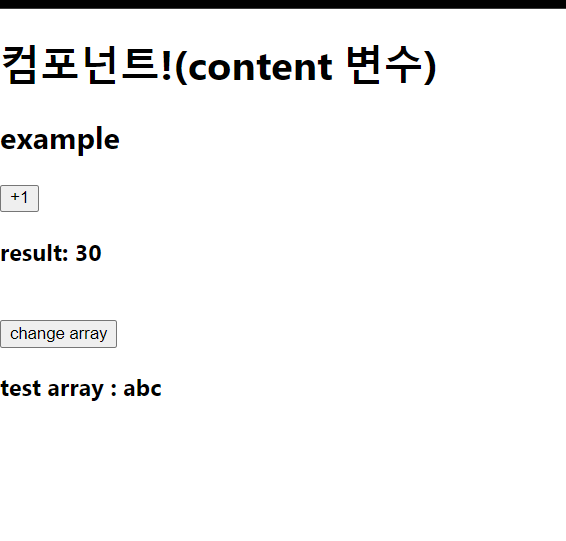

- 변경 후

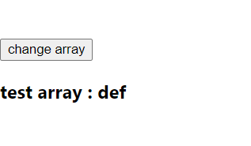

# **hooks**

> 리엑트는 다양한 hook을 제공하고 있다.
>
> 대표적으로 useEffect 훅이 굉장히 많이 쓰인다.

## **React 생애주기**

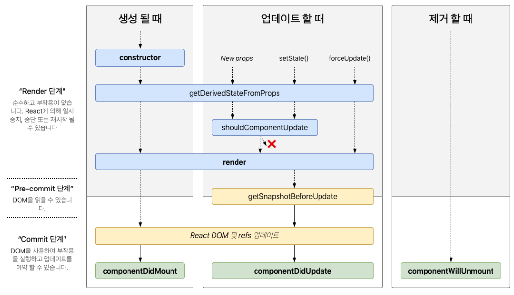

요약

- mounted : 컴포넌트가 처음 화면에 나타날 때(=페이지 진입)
- updated : 값이 변경될 때(초기 데이터 값 설정 및 갱신, state 업데이트 등 )
- unmounted : 컴포넌트가 화면에 없어질 때(=페이지 이탈)

## **useEffect**

컴포넌트가  `mounted`, `updated`, `unmounted` 될 때 동작을 `useEffect` 하나로 설정 가능하다.

- 기본적으로 React는 state값이 변경되면 컴포넌트 전체를 재랜더링 한다.

  ```jsx
  // ComponentName.js
  
  import React, { useState } from "react"
  
  const ComponentName = (props) => {
    const [changeValue, setChangeValue] = useState(30)
    const [testArray] = useState([]) 
  
   ...
   ...
   
    console.log("재랜더링!")
      
   ...
   ...
  
  export default ComponentName
  ```

  - 컴포넌트 재렌더링(새로고침 등) → 컴포넌트에 정의한 모든 코드들이 `컴포넌트가 mounted 될 때`, `state가 update` 될 때, 이렇게 총 두 번 실행되면서 콘솔에 '재렌더링!'이 2번 찍히게 된다.

  !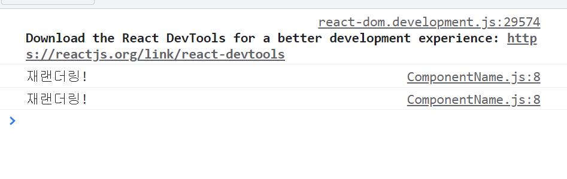

  - 이때 `+1` 버튼을 눌러 `changeValue` state를 변경하면 아래와 같이 '재렌더링!'이 또 2번 찍히는 것을 알 수 있다.

    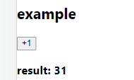

    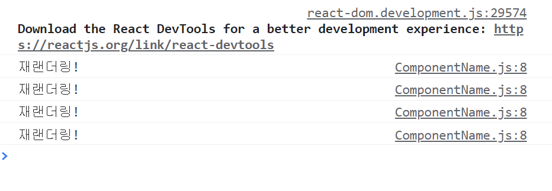

    - 왜냐하면 `changeValue` 라는 state가 변경되면서 컴포넌트 전체가 재렌더링이 되었기 때문이다.

  - 이는 changeArray 버튼을 눌러서 testArray 값을 바꿀 때에도 마찬가지다.

- state값이 변경될때마다 매번 컴포넌트를 재렌더링하지 않고, 특정 state값이 변경될 때에만 console에 재렌더링을 찍게 하고 싶다면?

  → useEffect 훅을 사용한다.

**useEffect hook 사용**

- 아래와 같이 useEffect를 import한 뒤에 사용한다.

  ```jsx
  import React, { useEffect } from "react"
  
  const ComponentName = () => {
      useEffect(() => {
          console.log('재렌더링!')
      }, [])
  }
  
  export default ComponentName
  ```

  - `[]`는 deps라고 하며, 값 변경을 감지할 변수를 넣어주는 자리다.

  - []가 없거나 []가 비어있다면, 해당 useEffect 훅 내부에 정의한 내용들은 `컴포넌트가 mounted, updated 될 때`와 `state로 선언된 값 중 하나라도 변경될 때` 실행된다.

  - 아래는 `mounted` , `updated` 시점에 콘솔로 출력된 결과다.

    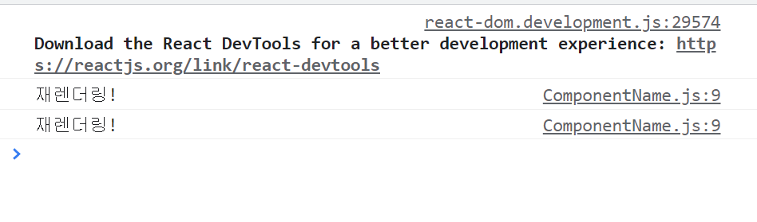

- 특정 state 값 변경만 감지하고 싶을 때

  - [] 자리에 state 변수 이름을 넣어주면 된다.

    ```jsx
    import React, { useState, useEffect } from "react"
    
    const ComponentName = (props) => {
      const [changeValue, setChangeValue] = useState(30)
      const [testArray, setTestArray] = useState(["a", "b", "c"])
    
      /////////////////////// changeValue 값이 변경될 때, 콘솔에 '재렌더링!' 출력
      useEffect(() => {
        console.log("재렌더링!")
      }, [changeValue])
     ////////////////////////
    
    ...
    ...
    
    export default ComponentName
    ```

    - 위와 같이 useEffect를 사용하면 `컴포넌트가 mounted, updated` 될 때와 `changeValue 라는 state가 변경될 때` 에만 '재렌더링!'이 콘솔에 찍힌다.

    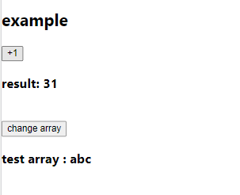

    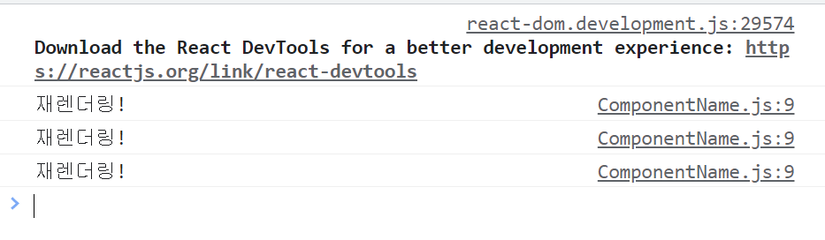

    - 위는 순서대로 mounted 될 때, state 초기 값이 updated 될 때, 버튼으로 state를 update를 했을 때 콘솔 결과이다.

    

    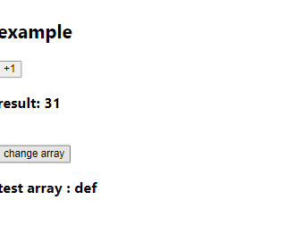

    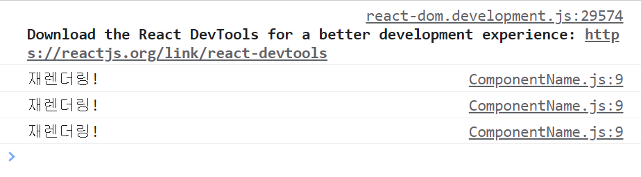

    - change array 버튼으로 test array state가 변경되었지만 콘솔에는 ''재렌더링!'이 찍히지 않는다.

  - 물론 [] 안에는 여러 state를 넣어주는 것 또한 가능하다.

    ```jsx
      useEffect(() => {
          consoel.log('재렌더링!')
      }, [changeValue, testArray])
    ```

- 그렇다면, 컴포넌트가 새로고침이나 페이지 진입을 했을 때, **mounted 훅을 무시하고 초기 state 값을 update하는 시점에만** ''재렌더링'을 콘솔로 찍게하는 방법은 무엇일까?

  - 즉, 새로고침을 했을 때 `1) 컴포넌트가 화면에 나타난다.` `2) 초기 데이터 값을 업데이트한다.` 중 1번을 무시하고 2번 시점에만 특정 코드를 실행시키고 싶을 때를 말한다.

  - 방법 중 하나는 useRef 훅을 사용하는 것이다.

    ```jsx
    import React, { useState, useEffect, useRef } from "react"
    
    ...
    ...
    
      const mounted = useRef(false)
    
      useEffect(() => {
        if (!mounted.current) {
          mounted.current = true
        } else {
          console.log("재렌더링!")
        }
      }, [])
    ```

    - 컴포넌트가 mounted 될 때(화면에 컴포넌트가 나타날 때)에는 재렌더링을 콘솔로 찍지 않고 현재 컴포넌트가 mounted가 되었음을 true로 표시한다.

    - 이후 초기 state값이 updated 되는 시점이 오면 조건 분기에 따라 else문에 있는 `console.log('재렌더링!')`이 실행된다.

    - 새로고침했을 때 console

      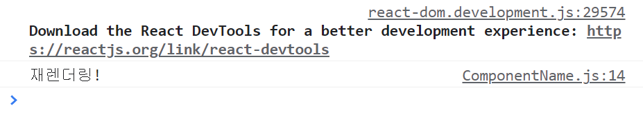

      - 재렌더링이 한번만 콘솔에 출력됨을 확인할 수 있다.

  - useRef는 가상 DOM을 쓰는 JSX 상에서 특정 DOM 엘리먼트를 참조하게 해주는 훅이다. 자세한 사항은 [공식문서](https://ko.reactjs.org/docs/hooks-reference.html) 참조!

- unmounted 는 어떻게 잡을 수 있을까?

  - 이른바 `clean up` 함수를 useEffect 내 return으로 반환해주면 된다.

    ```jsx
      useEffect(() => {
        if (!mounted.current) {
          mounted.current = true
        } else {
          console.log("재렌더링!")
        }
    	///////////////////// clean up
       return () => {
           console.log('페이지 탈출!')
    	/////////////////////
       }
      }, [])
    ```

    - 현재 페이지가 재렌더링 되면 컴포넌트는 생애주기에 따라 아래 과정을 거친다.
      1. 현재 페이지가 unmounted 된다.(unmounted)
      2. 새로 컴포넌트가 mounted가 된다.(mounted)
      3. 초기 state 값이 갱신된다.(updated)
    - 위 코드는 2번 과정이 if문으로 분기처리가 되었으므로 **`새로고침`을 했을 때 콘솔 창에는 아래와 같이 '페이지 탈출'과 '재렌더링!' 이 순서대로 출력**되어야 한다.

    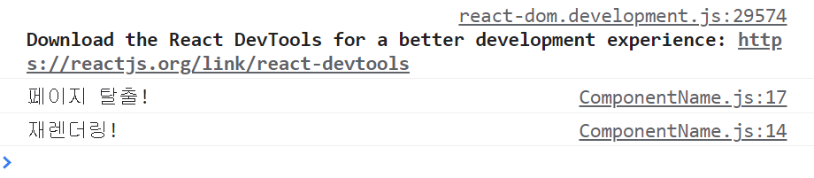

    - state가 변경될 때에도 재렌더링이 되므로 콘솔에는 페이지 탈출이 가장 위에 출력된다.

# 전체 코드

- code

  ```jsx
  // App.js
  
  import ComponentName from "./ComponentName.js"
  
  function App() {
    const value = "example"
  
    const handleClick = () => {
      alert("클릭!")
    }
  
    return (
      <div className="App">
        <ComponentName value={value} handleClick={handleClick}></ComponentName>
      </div>
    )
  }
  
  export default App
  ```

  ```jsx
  // ComponentName.js
  
  import React, { useState, useEffect, useRef } from "react"
  // import "./ComponentName.css"
  
  const ComponentName = (props) => {
    const [changeValue, setChangeValue] = useState(30)
    const [testArray, setTestArray] = useState(["a", "b", "c"])
  
    const mounted = useRef(false)
  
    useEffect(() => {
      if (!mounted.current) {
        mounted.current = true
      } else {
        console.log("재렌더링!")
      }
      return () => {
        console.log("페이지 탈출!")
      }
    }, [])
  
    const handleValue = () => {
      // changeValue += 1
      let temp = changeValue
      setChangeValue(temp + 1)
    }
  
    const handleArray = () => {
      let temp = [...testArray]
      temp = ["d", "e", "f"]
      setTestArray(temp)
    }
  
    return (
      <div className="class">
        <h1 className="title">{content}</h1>
        <h2> {props.value} </h2>
        <button onClick={handleValue}> +1 </button>
        <h3> result: {changeValue}</h3>
        <br />
        <button onClick={handleArray}> change array </button>
        <h3> test array : {testArray} </h3>
      </div>
    )
  }
  
  const content = "컴포넌트!(content 변수)"
  
  export default ComponentName
  ```

  ```css
  /* ComponentName.css */
  .class {
    background-color: red;
  }
  
  .title {
    color: white;
  }
  ```

# **References**

React를 공부하면서 참고하면 아주 좋은 사이트

- [벨로펀트와 함께하는 모던 자바스크립트](https://learnjs.vlpt.us/basics/)
- [벨로펀트와 함께하는 모던 리엑트](https://react.vlpt.us/)
- [리엑트 한글판 공식 문서](https://ko.reactjs.org/docs/getting-started.html)
- [React vs Vue](https://velog.io/@leehaeun0/React-vs-Vue-장단점-비교)
