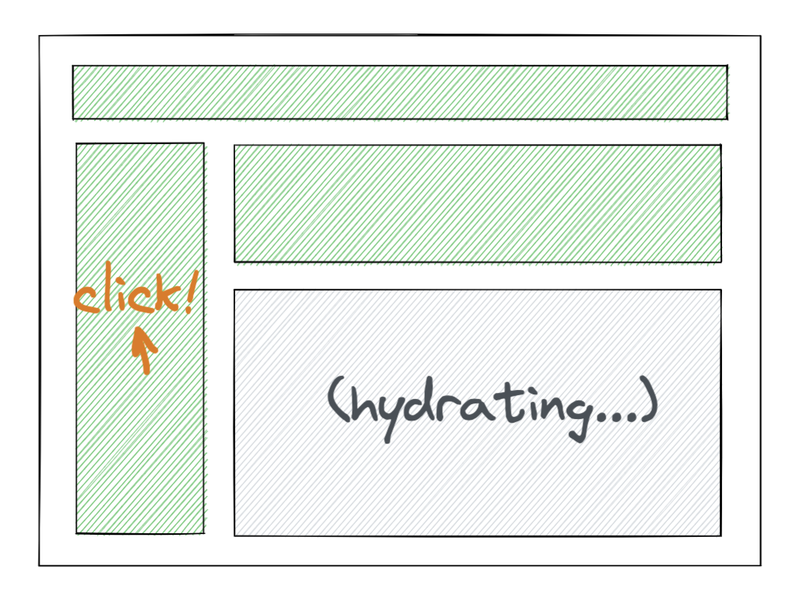

# What's new React 18


## createRoot()
```javascript
// Before
import { render } from "react-dom";

const container = document.getElementById("app");
render(<App tab="home" />, container);

// After
import { createRoot } from "react-dom/client";

const container = document.getElementById("app");
const root = createRoot(container);
root.render(<App tab="home" />);

```

- `createRoot()` 사용
  - React 18의 concurrent features(동시성 기능)을 사용할 수 있도록 설정

### hydrateRoot()
```js
// Before
import { hydrate } from "react-dom";
const container = document.getElementById("app");
hydrate(<App tab="home" />, container);

// After
import { hydrateRoot } from "react-dom/client";
const container = document.getElementById("app");
const root = hydrateRoot(container, <App tab="home" />);
// Unlike with createRoot, you don't need a separate root.render() call here.

```
- hydration을 위해 `hydrateRoot()` 를 사용


## Automatic Batching
- Batching이란? 
  - 여러 업데이트 작업을 일괄 처리
  - React 18 이전 버전에서는 이벤트 핸들러에 대해서만 Batching이 이루어졌음
  - React 18버전 부터 `createRoot()`를 통해 모든 업데이트 작업이 자동 배칭(Automatic Batching)

```js
// Before: only React events were batched
setTimeout(() => {
  setSize((oldSize) => oldSize + 1);
  setOpen((oldOpen) => !oldOpen);
  // React will render twice, once for each state update (no batching)
}, 1000);

// After: updates inside of timeouts, promises,
// native event handlers or any other event are batched
setTimeout(() => {
  setSize((oldSize) => oldSize + 1);
  setOpen((oldOpen) => !oldOpen);
  // React will only re-render once at the end (that is batching)
}, 1000);

```
- 18버전에서는 setTimeout 내부의 콜백 함수의 실행이 끝나야 re-render가 이루어짐  


## Transition
- 업데이트에 우선순위를 부여 -> 렌더링 최적화
- 시급하지 않은 업데이트를 나중에 진행하고 시급한 업데이트가 발생할 경우 해당 업데이트를 먼저 실행

```js
import { startTransition } from "react";

// Urgent: Show what was typed in the input
setInputValue(newInputValue);

// Mark any state updates inside as transitions and mark them as non-urgent
startTransition(() => {
  // Transition: Show the results
  setSearchQuery(newInputValue);
});

```
- 검색 결과를 업데이트하는 것보다 사용자가 입력한 검색어를 갱신하는 것이 더 우선순위가 높음
- 검색 결과 업데이트를 `startTransition()` 으로 감싸서 업데이트 우선순위를 낮춘다.(업데이트 예약)
- urgent-update가 연달아 일어날 경우, 렌더링 작업을 잠시 중단하고 가장 최신의 업데이트에 대해서만 렌더링


### useTransition hook
- Transition이 일어나고 있는 상태를 체크할 수 있음
```js
function App() {
  const [isPending, startTransition] = useTransition();
  const [count, setCount] = useState(0);

  function handleClick() {
    startTransition(() => {
      setCount((oldCount) => oldCount + 1);
    });
  }

  return (
    <div>
      <span>Current count: {count}</span>

      {isPending && <Spinner />}

      <button onClick={handleClick}>Increment</button>
    </div>
  );
}
```


## Suspense
- 특정 컴포넌트의 작업이 끝난 후에 렌더링되는 것이 아닌, fallback UI 먼저 대체하고 다른 컴포넌트를 렌더링 -> 이후 해당 컴포넌트의 작업이 완료되면 렌더링
- 모든 컴포넌트가 렌더링될 때까지 기다리지 않고, 특정 컴포넌트에서 렌더링에 필요한 작업을 수행하는 동안 다른 컴포넌트를 먼저 렌더링
- 기존에는 `React.lazy()` 를 통한 코드 스플릿을 클라이언트 단에서 실행하여 동적으로 컴포넌트를 import 하는 방식으로 유사한 기능 수행
  - 해당 컴포넌트의 load를 사용자가 진입할 때에만 진행하는 방식
  - javascript 번들 사이즈에 대한 부담을 줄이는 역할
- React 18에서 Suspense를 사용하면 서버단에서도 컴포넌트의 렌더링을 최적화시킬 수 있음(물론 클라이언트에서도 Suspense 활용 가능)

### 클라이언트 사이드 렌더링
- Streaming HTML
- 데이터 패칭이 완료되기 이전(loading)이나 오류가 발생(error)한 경우에 대해서 `fallback` 으로 전달
- 비동기 요청 작업이 진행 중이면 fallback으로 전달했던 컴포넌트를 대신 보여주고, 작업이 완료되면 비동기 요청으로 얻은 데이터를 반영하여 Suspense의 하위 컴포넌트를 렌더링
- Suspense는 동기적으로 수행
```js
<Suspense fallback={<BigSpinner />}>
  <Biography />
  <Suspense fallback={<AlbumsGlimmer />}>
    <Panel>
      <Albums />
    </Panel>
  </Suspense>
</Suspense>
```
  1. Biography가 로드되지 않았다면 전체 화면에 대해서 BigSpinner로 대체
  2. Biography가 로드되었다면 BigSpinner는 로드된 컨텐츠로 대체되어 사라짐
  3. 그러나 아직 Albums가 로드되지 않았다면, Pannel과 Albums는 AlbumsGlimmer로 대체
  4. 로드가 완료되었다면 AlbumsGlimer는 로드된 컨텐츠로 대체되어 사라짐


### 서버 사이드 렌더링
- Selective hydration
- SSR: HTML 콘텐츠를 먼저 로드하여 UI에 보여주고, 이후 JS 코드를 로드하여 사용자와 상호작용할 수 있도록 hydration 진행
- 원래 hydration은 모든 컴포넌트가 로드된 이후에 진행되어야 하지만, Suspense로 감싼 컴포넌트는 로드될 때까지 기다리지 않는다.
- 아직 로드되지 않는 컴포넌트에 대해서 일단 스트리밍된 HTML을 보여주고, Suspense된 컴포넌트를 제외한 나머지 로드한 컴포넌트에 대해서 먼저 hydration
  - 다른 컴포넌트에 대해 hydration을 먼저 진행하고, 로드가 완료되면 그때 Suspense로 감싼 컴포넌트에 hydration 진행
    - 효과) 번들 사이즈가 큰 페이지에 대해 일부 컴포넌트의 로드가 지연되면서 hydration이 완료되지 않아 상대적으로 가벼운 다른 컴포넌트(ex_ navBar, sideBar)와 상호작용하지 못하는 일을 방지
    - 여러 컴포넌트가 Suspense라면 tree 상에서 먼저 발견되는 Suspense 바운더리에 대해 먼저 hydration



## 5 new hooks in React 18
### useId
- 서버, 클라이언트 양측에서 unique한 id를 생성하는 훅
- hydration이 mismatching되는 것을 방지
```js
function CodeOfConductField() {
  const id = useId();

  return (
    <>
      <label htmlFor={id}>Do you agree with our Code of Conduct?</label>
      <input id={id} type="checkbox" name="coc" />
    </>
  );
}

```
### useTransition
- Transition 항목 참고


### useDeferredValue
- Tree에서 급하지 않은 부분에 대한 리렌더링을 지연
- 디바운스와 스로틀링과 비슷하지만, 고정된 시간이 없다는 것이 큰 이점
- 사용자 검색을 간섭하는 일을 방지할 수 있음
```js
function SearchResults() {
  const query = useSearchQuery("");
  const deferredQuery = useDeferredValue(query);

  // Memoizing tells React to only re-render when deferredQuery changes,
  // not when query changes.
  const suggestionResuls = useMemo(
    () => <SearchSuggestions query={deferredQuery} />,
    [deferredQuery]
  );

  return (
    <>
      <SearchInput query={query} />
      <Suspense fallback="Loading suggestion results...">
        {suggestionResuls}
      </Suspense>
    </>
  );
}
```
- query가 아닌 deferredQuery가 변경될 때에만 검색결과 창 업데이트.

### useInsertionEffect
- useLayoutEffect가 동작하기 전에 스타일을 먼저 조작
- `css in js`가 rendering 도중에 style 규칙을 삽입하는 과정에서 발생하는 성능 문제를 해결하기 위해 사용
  - useLayoutEffect로 하면 스타일 규칙을 삽입하는 여러 개의 커스텀 훅이 여러 useLayoutEffect을 실행하는 경우에 문제 발생
    - `useLayoutEffect`는 모든 DOM 업데이트를 마치고 나서 동기적으로 실행
    - 이 훅을 사용하는 다른 커스텀 훅에서 스타일을 변경시키면 다른 커스텀 훅에서는 아직 스타일 업데이트가 일어나지 않은 레이아웃과 스타일을 계산하고 있는 상황이 되기 때문에 계산이 달라지면서 의도치 않은 버그가 발생할 수 있는 것 -> 동시성 이슈
    - React 18애서는 이 문제를 해결하기 위해 `useInsertionEffect`를 사용 가능
    - useInsertionEffect 훅 내부에서 스타일 규칙을 삽입하고, 레이아웃 계산을 이후에 실행되는 useLayoutEffect에서 담당하면 성능 개선 및 버그를 해결할 수 있다.
- 모든 DOM mutations가 일어나기 전에 동기적으로 동작
  - DOM 요소를 ref로 참조할 수 없음
- **useInsertionEffect -> useLayoutEffect -> useEffect
**

## 참고

https://blog.appsignal.com/2022/04/13/whats-new-in-react-18.html

https://react.dev/reference/react/Suspense#revealing-content-together-at-once

https://blog.mathpresso.com/suspense-ssr-architecture-in-react-18-ec75e80eb68d


https://github.com/reactwg/react-18/discussions/37