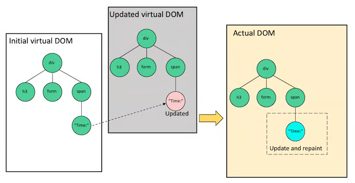

# Virtual DOM

- **Virtual DOM이란, React에서 UI를 빌드하고 업데이트할 때 활용하는 Object**
  - 개념적으로는 UI의 상태를 나타낸 객체
- Javascript를 통해 화면을 업데이트하면 브라우저가 변화를 감지하여 화면 전체를 re-paint한다.
  - ex) 버튼을 클릭할 때마다 박스가 추가되는 경우, 이미지를 삭제하는 경우 등
  - React는 Virtual DOM을 활용 및 reconciliation
    과정을 거쳐 전체 페이지 중 변화가 있는 특정 노드만 업데이트하여 Real DOM에 반영한다.
- 변경사항이 생길 때마다 페이지 전체를 업데이트하는 것보다 성능 상 이점이 있음
  - repainting 동작이 무거운 작업이기 때문.
  - 하지만 **반드시** Javascript보다 빠르다고는 할 수 없다.
  - 애초에 React는 더 빠른 속도를 목적으로 하는 것이 아니라 UI 화면의 업데이트와 유지보수를 더 쉽고 간편하게 적용하는 것이 목적

---

## React의 화면 렌더링 과정

1. React library가 Real DOM의 snapshot으로 virtual DOM을 생성하고 메모리에 저장
2. 특정 노드에 변화가 생기면 변경사항이 적용된 Virtual DOM 복사본을 생성
   - 만약 여러 state가 변경되는 경우, 매 변경사항 마다 화면을 업데이트 하지 않고 **batch update** 방식으로 업데이트
   - bacth update는 **react 16**부터 등장하기 시작
     - **react 18** 이전까지 이벤트 핸들러 내부에서만 발생하는 업데이트만 batch를 지원하는 등 batch update가 일관적이지 않았음
     - **react 18부터 automatic batching을 지원**
3. Real DOM을 copy한 virtual DOM과 변화가 생긴 virtual DOM을 비교하여 차이가 있는(업데이트 된) 부분을 탐색(diff algorithm)
4. 최종적으로 변화가 있는 부분만 Real DOM에 반영(Reconciliation) + 이때 `ReactDOM` renderer를 활용하여 UI 업데이트 사항을 적용 가능

## 참고)

https://legacy.reactjs.org/docs/reconciliation.html#the-diffing-algorithm

https://blog.logrocket.com/virtual-dom-react/

https://adhithiravi.medium.com/react-virtual-dom-explained-in-simple-english-fc2d0b277bc5

batch update : https://github.com/reactwg/react-18/discussions/21
